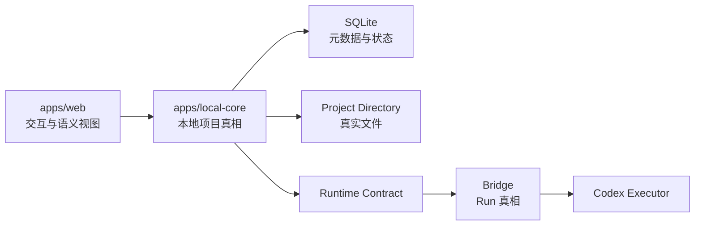

# Local Creative OS 后端新对话交接

> 日期：2026-07-23  
> 用途：交给新开的“后端 / Local Core 主控对话”  
> 状态：现状盘点与开工边界，不代表已授权实现全部 Alpha 后端  
> 项目路径：`E:\Codex 项目\OS开发`

## 0. 先读结论

Local Creative OS 的产品方向已经比较稳定，前端也形成了一份完整的 `v0.6.0` 候选包；但**主仓库、前端候选包、后端合同与真实 Runtime 目前还没有收敛成同一个可提交基线**。

当前事实：

- 前端 `v0.6.0` 候选包已完成完整回归，结论为 **PARTIAL PASS**；
- 前端黄金任务链已验证到 `Continue Modify`，但 Child Scope 闭环和同一正常链上的 Accept 证据仍不完整；
- `packages/domain` 与 `packages/contracts` 已有纯 TypeScript 最小合同；
- `apps/local-core` 尚不存在；
- SQLite、项目目录、文件导入、Watcher、Preview、Context 持久化、Version、SSE、真实 Bridge Adapter 均未实现；
- Bridge 有真实 Task / WorkBuddy 生命周期，但还不是 OS Alpha Runtime Spine，不能直接把现状接到 OS；
- 主仓库当前工作区不干净，最新前端候选仍以独立 ZIP 存在，不能把 ZIP 的通过结果误认为主仓库已经合入。

因此新后端对话的第一阶段应当是：

```text
确认代码基线
→ 冻结最小后端合同
→ 建立 Local Core 可移除骨架
→ 做只读 Project / Artifact / Preview Spike
→ 再接持久化与 Runtime
```

不要一上来同时做 SQLite、Watcher、Bridge、文件写回和完整 REST。

---

## 1. 产品到底是什么

Local Creative OS 是一个面向个人创意工作的本地项目操作系统。

它不负责代替 PowerPoint、Figma、Canva、飞书、Notion 或图片/视频编辑器制作内容。它负责：

- 查看项目资料；
- 形成和记录判断；
- 组织可追溯 Context；
- 创建 Command；
- 派发真实 Run；
- 跟踪执行状态；
- 回收 Changed Files / Artifact；
- 管理 Revision、Checkpoint 和恢复。

Alpha 要证明的真实闭环：

```mermaid
flowchart LR
    A["打开本地 Project"]
    --> B["恢复 Workspace / Canvas"]
    --> C["查看 Artifact / Preview / Note"]
    --> D["选择 Target 与 Context"]
    --> E["创建并确认 Command"]
    --> F["真实 Codex Run"]
    --> G["waiting_input / review"]
    --> H["Changed Files / Artifact Return"]
    --> I["Accept / Retry"]
    --> J["Checkpoint"]
    --> K["关闭并恢复"]
```



架构归属：



硬边界：

- OS 管项目；
- Local Core 管本地项目真相；
- Bridge 管 Run 与执行事件；
- GUI / Codex 对话只承载会话；
- 文件系统保存真实内容；
- SQLite 不保存大 BLOB；
- Web 不直接读写任意本地文件；
- AI 结果在人工确认前必须是 Draft / Pending；
- 不得静默覆盖人工 Current。

---

## 2. 必读文档与事实优先级

发生冲突时：

1. 用户当前明确指令；
2. 当前获批 Sprint / Handoff；
3. `AGENTS.md`；
4. 最新 PRD 冻结稿；
5. 最新 UI & Interaction Spec 冻结稿；
6. `README.md`；
7. 已批准 ADR；
8. 旧文档与历史 Prototype。

后端对话开始前必须阅读：

1. `README.md`
2. `AGENTS.md`
3. `CODEX_START_HERE.md`
4. `docs/DEVELOPMENT_REQUIREMENTS.md`
5. `OS项目文档/Local_Creative_OS_PRD_V1.2_UI冻结决策回写版.docx`
6. `OS项目文档/Local_Creative_OS_UI_Visual_Interaction_Spec_v0.2_冻结决策稿.docx`
7. `OS项目文档/01_Current_Core/Local_Creative_OS_GUI_Project_Coordination_ADR.md`
8. `OS项目文档/01_Current_Core/Local_Creative_OS_Storage_Cache_Performance_Budget.md`
9. `docs/handoffs/FRONTEND_ALPHA_CONTRACT_HANDOFF.md`
10. `docs/audit/BRIDGE_ALPHA_RUNTIME_SPINE_AUDIT_RETURN.md`
11. 本文

旧 AdFrame 只作为 Review Prototype 与历史模块来源，不是新 OS App Shell：

- AdFrame 对话：`codex://threads/019f69d0-f0f0-7612-98f1-8c6bb245a323`
- 冻结旧仓库：`E:\Codex 项目\演示demo`

---

## 3. Git 与代码基线现状

### 3.1 主仓库

- 路径：`E:\Codex 项目\OS开发`
- 当前分支：`refactor/reusable-review-core`
- 当前 HEAD：`1f85697 docs: review buddy alpha readiness evidence`
- 最近稳定基线提交包括：
  - `1f85697`
  - `93d97ff`
  - `fc46363`
  - `9379193`
  - `a75c954`
  - `da69567`
  - `44a6131`
  - `bc89de5`
  - `b1067dc`

当前工作区不干净：

- 已修改：`index.html`、`package.json`、`package-lock.json`
- 未跟踪：`apps/`、`packages/`、`tests/e2e/`、前端截图、测试证据、前端测试包等
- `git diff --check` 仅出现 LF/CRLF 警告，没有发现空白错误

**后端对话不得在未确认基线前直接大范围写代码。**

必须先由主控确认二选一：

1. 将获批的前端、domain/contracts 与文档整理为新的可审查基线提交；或
2. 为后端建立独立、明确来源的干净 worktree / 分支，只在批准目录内工作。

不要把未跟踪文件当成已经提交的正式基线，也不要用 `git reset --hard` 清理。

### 3.2 v0.6.0 前端候选包

候选包：

`E:\Codex 项目\OS开发\前端测试\v0.6大版本测试\收口测试\Local_Creative_OS_v0.6.0_Frontend_Complete.zip`

SHA256：

`0EEEDB459F3AC778053E2C5885EDD205FDD32208F27D62FCE262C77D5ED40626`

完整回归：

- 结论：`PARTIAL PASS`
- 质量链：全部通过
- 依赖漏洞：0
- 单测：22 files / 73 tests
- Build：1802 modules
- Console：0 error / 0 warn
- 截图：24 张真实 Chrome 截图

报告：

`E:\Codex 项目\OS开发\前端测试\v0.6大版本测试\收口测试\v0.6.0-full-regression-evidence\QA_REPORT_v0.6.0.md`

证据包：

`E:\Codex 项目\OS开发\前端测试\v0.6大版本测试\收口测试\Local_Creative_OS_v0.6.0_Full_Regression_Evidence_20260723.zip`

证据包 SHA256：

`1B0A25E3480BB5BB3F1891C13DF9A3F5F9437545B7F8B9B60C698EC02D217C34`

当前主要前端缺口：

- Child Scope 返回父 Canvas 后没有可重进的 Container；
- 因此 Child Workspace、重进同一 Child、删除 Scope 树但保留父 Artifact 的正常闭环未验证；
- Accept / Checkpoint 只由独立 Fixture 证明目标状态可渲染，没有在同一正常任务链中完整验收；
- Workspace 复制/排序/删除、完整 clipboard / Undo / Redo / 关系模板、固定节点 Ghost 排除仍缺完整证据；
- lint 有 7 条非阻断 warning。

后端实现不得依赖这些未通过的前端状态作为既成事实。

---

## 4. 当前代码完成度

### 4.1 `apps/web`

主仓库工作区已有 Frontend Interaction Foundation 的源码，包括：

- App Shell；
- Workspace Dock；
- Canvas、Mini-map、节点、选择与关系；
- Inspector；
- Command；
- Fixture Run 状态；
- Workspace 状态纯函数；
- Fixture Adapter。

但主仓库这一份代码不是最新 `v0.6.0` 候选包的可靠同义副本；新后端不能只看主仓库 `apps/web` 就推断完整前端合同。

当前 Web 仍直接消费：

- `apps/web/src/model.ts`
- `apps/web/src/fixtures.ts`

它尚未迁移到 `@local-creative-os/domain` / `@local-creative-os/contracts`。

### 4.2 `packages/domain`

已经实现纯 TypeScript 领域词汇和少量纯规则：

- Project / Workspace / WorkspaceViewport；
- Artifact / ArtifactView / ArtifactRevision；
- Preview；
- Note / NoteAnchor；
- ContextSnapshot；
- Command / Conversation；
- Run / RunEvent；
- ChangedFile；
- ArtifactReturn；
- Checkpoint；
- Artifact Return 落位优先级；
- terminal Run status 判断；
- `fixture | runtime` 来源区分。

Run 状态：

```text
queued
running
waiting_input
review
completed
failed
cancelled
```

已经有独立 package、严格 TypeScript 配置和单测。

### 4.3 `packages/contracts`

已经有纯边界接口：

- `WorkspaceQueryContract`
- `PreviewContract`
- `ProjectContract`
- `ArtifactContract`
- `ContextContract`
- `ExecutionRuntimeContract`
- `Result<T>`
- `ContractError`
- `ContractOrigin = fixture | runtime`

这些接口不代表：

- REST 已实现；
- SQLite 已实现；
- 文件系统访问已实现；
- Preview 已实现；
- Bridge 已接通。

### 4.4 根质量门现状

根 `package.json` 虽声明 `apps/*` 与 `packages/*` workspace，但当前根脚本主要调用 Web：

```text
lint
typecheck
test
build
smoke
check
```

`domain/contracts` 有自己的脚本，但主仓库根 `check` 是否覆盖它们，必须在正式合并基线后重新核对，不能引用旧对话结论代替实际运行。

### 4.5 `apps/local-core`

当前不存在。

以下均为缺失或未实现：

- Node.js + TypeScript Local Core；
- 仅绑定 `127.0.0.1` 的本地 API；
- SQLite schema / migration；
- Project Catalog；
- Project Directory 与 `.creative-os`；
- Artifact 导入、哈希与重复识别；
- ArtifactView / Workspace / Camera 持久化；
- 文件 Watcher；
- 外部修改 / stale / conflict；
- MD / 图片 / PPT / PDF Preview Adapter；
- Preview 缓存；
- Note 持久化；
- Context Snapshot 构建与脱敏；
- Revision / Current / Draft；
- Checkpoint；
- Runtime / Bridge Adapter；
- SSE replay；
- restart recovery；
- 写租约与写前哈希校验。

---

## 5. Bridge 的真实状态

Bridge 对话：

`codex://threads/019f462f-5bfb-7450-943e-2a40e0ca32c7`

只读审计结论：

- Bridge 有真实本地 Task 生命周期；
- WorkBuddy 路由、claim、状态和回传有真实证据；
- `changed_files` 与 Artifact 结构有部分实现；
- 但 Bridge **还不是 OS Alpha Runtime Spine**。

当前关键缺口：

- 没有 canonical `runId`；
- 没有一等 `waiting_input`；
- 没有完整、有序、可 replay 的 Run Event / SSE；
- 没有 immutable ContextSnapshot 绑定；
- 没有 project-root containment；
- 没有 write lease；
- 没有 before / after hash；
- 没有 conflict → `waiting_input`；
- Artifact Return 没有 Pending / Accept / Revision 合同；
- 没有 durable externalThreadId；
- restart recovery、idempotent dispatch 与日志脱敏不足。

结论：

> 不要直接把 OS 接到当前 Bridge Task API。先冻结 Runtime Contract，再做兼容 Adapter。

旧 WorkBuddy 三项审计已经结束，Bridge 值守也已停止。旧审计报告可参考，但不能作为后端实现授权。

---

## 6. 新后端对话建议职责

新对话只负责：

- `apps/local-core`
- `packages/domain`
- `packages/contracts`
- 后端相关测试与 Handoff

未经额外批准，不修改：

- `apps/web`
- Canvas 交互与视觉
- `packages/ui`
- Figma / Make 材料
- Bridge 仓库
- 旧 AdFrame 仓库

如前端 Adapter 需要变更，先提出最小接口建议，由前端 owner 实施。

---

## 7. 建议后端推进阶段

### Gate 0：基线与合同冻结

目标：

- 明确主仓库是否以 `v0.6.0` 候选包为前端基线；
- 整理并提交或建立干净 worktree；
- 比较 v0.6.0 的前端模型与现有 domain/contracts；
- 只冻结 Alpha 真正需要的合同。

验收：

- Git 来源可追溯；
- 文件所有权明确；
- 根质量门覆盖 Web、Domain、Contracts；
- Fixture 与 Runtime 类型分离；
- 无后端实现。

### Phase 1：Local Core 只读骨架

目标：

- `apps/local-core` 可启动；
- 只绑定 `127.0.0.1`；
- 健康检查；
- Project root 校验；
- Project Catalog 查询；
- Artifact metadata 查询；
- 统一结构化错误与取消。

暂不写文件、不接 Bridge。

验收：

- 任意非 loopback 绑定失败；
- 非法路径、路径逃逸和缺失目录有结构化错误；
- 可关闭服务并释放句柄；
- Web Adapter 可在 Fixture / Runtime 间明确切换。

### Phase 2：SQLite 元数据与恢复

目标：

- schemaVersion / migration；
- Project、Workspace、Scope、Artifact、ArtifactView、Relation、Note、Revision、Checkpoint 元数据；
- Camera / Zoom / Work Rail UI preference 与正式项目数据分开；
- 不存大 BLOB；
- 关闭重开恢复。

验收：

- migration 可回滚或有明确恢复路径；
- 删除 ArtifactView 不删除 Artifact；
- 同一 Artifact 可在多个 Workspace / Scope 有多个 View；
- explicit additional View 不被默认去重规则阻断；
- Current Revision 唯一；
- Fixture 数据不写入正式库。

### Phase 3：文件导入、哈希与 Preview

目标：

- 本地 MD、图片、PPT/PDF 文件引用；
- 导入默认不移动原文件；
- 内容哈希与重复识别；
- Preview Adapter；
- 可再生缓存与清理；
- missing / stale；
- 文件级与 PPT/PDF 当前页备注。

验收：

- 文件释放坐标由 Web 管，文件身份由 Core 管；
- Blob URL / 文件句柄释放；
- 缓存清理后 Project 仍可恢复；
- Preview 不可用时诚实返回，不伪造内容；
- Windows 路径、权限和文件被占用有真实用例。

### Phase 4：Context / Revision / Checkpoint

目标：

- immutable ContextSnapshot；
- 来源清单、版本、哈希和脱敏字段；
- Draft / Current / superseded；
- Artifact Return 接受前保持 Pending；
- 手动 Checkpoint；
- external change 登记。

验收：

- Run 只能引用一个不可变 ContextSnapshot；
- 接受前不得改变 Current；
- 覆盖必须预览、确认并保留 Revision；
- 外部修改不得自动归因给最近 Run。

### Phase 5：Runtime / Bridge Spike

目标：

- 冻结 `createRun / continueRun / retryRun / cancelRun`；
- canonical `runId`；
- legacy Bridge `task_id` 映射；
- Run Event / SSE replay；
- `waiting_input`；
- Changed Files / Artifact Return；
- executor external thread mapping；
- restart recovery。

先做 disposable project 的单写 Spike，不进入真实用户目录。

验收：

- 5 次 Run 至少 4 次正确 Return；
- `waiting_input` 可暂停、恢复和取消；
- Retry 生成新 attempt / lineage，不篡改旧 Run；
- 重启后非终态 Run 可恢复或明确进入 recovery-required；
- UI、Core、Bridge 三方状态一致。

### Phase 6：安全写入

目标：

- declared write set；
- write lease；
- before / after hash；
- project-root containment；
- stale / conflict → `waiting_input`；
-安全 Artifact Return。

验收：

- 路径逃逸被拒绝；
- 同文件并发写冲突；
- 外部修改不被覆盖；
- 取消释放 lease；
- AI 修改默认新 Revision；
- 无静默覆盖 Current。

---

## 8. 新后端对话第一轮不要做什么

- 不同时实现 SQLite、Watcher、Bridge 和文件写回；
- 不直接修改 `apps/web` 迁移全部 Fixture；
- 不把 REST 路径、SQL 表和字段从 Buddy 草案复制成“冻结事实”；
- 不把 Workspace 建成独立 Graph、页面或真实目录；
- 不在 SQLite 保存文件 BLOB；
- 不让 Web 直接访问任意本地路径；
- 不让 Bridge 管 Canvas / Workspace 坐标；
- 不把 Task ID 直接当 canonical Run ID；
- 不把 CopyOnly / Fixture 定时器当真实 Runtime；
- 不把 AI Return 自动设为 Current；
- 不接 Notion、飞书写回、Figma、Canva、Buddy 深度集成；
- 不引入 Electron / Tauri；
- 不提交密钥或明文凭证；
- 不开放局域网 / 公网监听。

---

## 9. 测试与协作习惯

这是用户已经明确冻结的工作方式，新后端对话默认遵循。

### 9.1 日常开发测试

后端日常小切片优先“尽快可用”：

- 服务能启动和停止；
- 本轮接口能用；
- 相关单测通过；
- 无阻断日志；
- 文件安全底线通过。

不要每个小改动都跑交付级全链、全部状态、全部分辨率和大报告。

完整质量链只用于：

- 后端首次接入前端；
- 跨轨整合；
- 稳定 Git 提交；
- Schema migration；
- Runtime / Bridge 接通；
- 阶段收口与正式候选包。

### 9.2 遇错时怎么测

测试不能只报第一个错误就整轮停止。

规则：

1. 保留当前失败链的干净证据；
2. 停止继续污染同一链；
3. 其他互不依赖模块继续测试；
4. 必要时使用独立 Fixture / 测试项目验证后续局部状态；
5. Fixture 绕过只能记为局部 PASS，不能算端到端通过；
6. 报告用 `PASS / PARTIAL PASS / FAIL / UNREACHABLE` 清楚区分。

### 9.3 子智能体怎么用

- 子智能体使用“够用级别”，不要默认高成本长链；
- 先专项冒烟，再决定是否扩大；
- 截图控制为最小证据集；
- 已有静态检查通过时，不重复相同检查；
- 核心失败不做无限源码深挖，记录后继续独立模块；
- 大版本收口或后端正式接入时，才安排完整回归；
- 子智能体结果必须由主控验收，不把其自报结论直接当事实。

### 9.4 子对话分工

- OS 主控：产品范围、架构、阶段边界、整合与最终验收；
- 前端对话：`apps/web`、`packages/ui`、交互和视觉；
- 后端对话：`apps/local-core`、`packages/domain`、`packages/contracts`；
- 测试对话：只读验收、真实浏览器 / Runtime 证据、Golden / Failure Path；
- Bridge：Run / Event / Changed Files / Artifact Return，不做 UI；
- Buddy：外围研究、截图清单、兼容性或只读审计，不修改核心代码。

同一核心文件不能由多个任务同时修改。

### 9.5 Buddy / Bridge 协作习惯

- 能由当前项目子对话直接派 Buddy 时直接派，不经过 Bridge 对话三层中转；
- 没有 Bridge 工具时直接回报，不绕路虚报；
- Buddy 不改核心业务代码；
- 自动往返最多：

```text
Codex 派单
→ Buddy 回传
→ Codex 一次返工续单
→ Buddy 第二次回传
```

第二次仍不通过就停止并汇报。

结果证据优先级：

```text
仓库文件 / Git / 真实测试
→ Bridge 状态、changed_files、artifacts
→ Markdown Handoff
→ 聊天摘要
```

聊天记忆和深度链接不是真相源。

### 9.6 报告风格

日常报告短而具体：

- 现在能用什么；
- 最大阻断是什么；
- 下一小步是什么；
- 修改文件；
- 真实测试结果；
- 未验证与回滚点。

不要为了展示流程制造长篇报告；正式阶段报告再完整展开。

---

## 10. 子对话盘点

### OS 主控

- Thread：`019f7958-59f0-7833-bf02-288b90b4222a`
- 角色：唯一产品、架构、Alpha Scope、Sprint 和整合状态源
- 当前：正在将前端候选、合同、测试习惯与后端边界收敛为本文

### 前端子对话

- Thread：`019f7d9b-f2fe-7143-91f2-a7084a803f10`
- 职责：`apps/web`、`packages/ui`
- 历史完成：Canvas 手感、双指平移、Dock、Workspace、Overlay、Fixture 状态等多轮迭代
- 当前注意：该对话最后的工作区实现早于独立 `v0.6.0` 收口包，不能把其聊天末态当最新前端基线
- 最新前端事实应以 v0.6.0 ZIP + QA 报告为准

### Domain / Contracts 子对话

- Thread：`019f7d9c-0d47-79d1-a082-2dc422f6732d`
- 职责：`packages/domain`、`packages/contracts`
- 已完成：最小纯 TypeScript 合同、来源标识和包内测试
- 未完成：Local Core、SQLite、REST、Preview、Bridge
- 当前状态：空闲，可由新后端主控接管或作为 contracts 专项对话继续使用

### 测试子对话

- Thread：`019f7d9c-3417-7bc1-bd29-daa31b708173`
- 职责：质量门、真实浏览器验收、Golden / Failure Path
- 历史：完成多轮前端状态复验；后期独立候选包测试主要由当前 OS 主控的测试子智能体完成
- 最新事实：v0.6.0 完整回归报告
- 新后端阶段：只读验证 Local Core、SQLite migration、文件路径/权限、恢复、Runtime 状态和安全写入

### Bridge 对话

- Thread：`019f462f-5bfb-7450-943e-2a40e0ca32c7`
- 状态：旧值守已停止
- 用途：Bridge 项目本身的 Runtime 升级，不是 OS 后端日常任务的必经中转站

---

## 11. 新后端对话建议首轮任务

首轮只做只读接管与 Phase 0 提案，不直接编码：

1. 阅读本文列出的必读文档；
2. 检查 Git 状态、分支、最近提交和 diff；
3. 核对 `v0.6.0` 候选包与主仓库差异；
4. 检查 domain/contracts 与前端 v0.6.0 模型差异；
5. 确认 `apps/local-core` 不存在；
6. 输出后端 Phase 0：
   - 目录；
   - 最小合同；
   - 预计修改文件；
   - 流程图；
   - 测试；
   - 风险；
   - 回滚；
   - 需用户决定项；
7. 等主控批准后再创建 Local Core。

建议第一条真正的编码任务：

> 建立仅绑定 `127.0.0.1` 的 Local Core 只读骨架，实现 health、Project root 校验和只读 Project Catalog；不引入 SQLite，不读写用户文件，不接 Bridge，通过结构化 Result/Error 和可取消启动/关闭测试。

---

## 12. 可直接贴给新后端对话的开场指令

```text
你是 Local Creative OS 的后端 / Local Core 主控。

项目路径：
E:\Codex 项目\OS开发

先完整阅读：
1. README.md
2. AGENTS.md
3. CODEX_START_HERE.md
4. docs/DEVELOPMENT_REQUIREMENTS.md
5. docs/handoffs/LOCAL_CREATIVE_OS_BACKEND_THREAD_HANDOFF_2026-07-23.md
6. OS项目文档/Local_Creative_OS_PRD_V1.2_UI冻结决策回写版.docx
7. OS项目文档/Local_Creative_OS_UI_Visual_Interaction_Spec_v0.2_冻结决策稿.docx
8. OS项目文档/01_Current_Core/Local_Creative_OS_GUI_Project_Coordination_ADR.md
9. OS项目文档/01_Current_Core/Local_Creative_OS_Storage_Cache_Performance_Budget.md
10. docs/handoffs/FRONTEND_ALPHA_CONTRACT_HANDOFF.md
11. docs/audit/BRIDGE_ALPHA_RUNTIME_SPINE_AUDIT_RETURN.md

先检查 Git status、branch、log -10、diff --check。

当前不要直接编码。先完成只读接管：
- 明确主仓库与 v0.6.0 前端候选包不是同一个已提交基线；
- 核对 packages/domain、packages/contracts 的真实实现；
- 确认 apps/local-core、SQLite、文件导入、Watcher、Preview、Context、Version、Runtime/Bridge Adapter 的实际缺口；
- 输出后端 Phase 0 提案、预计修改文件、验收、风险、回滚和需确认项。

职责边界：
- 只负责 apps/local-core、packages/domain、packages/contracts 与后端测试/文档；
- 不修改 apps/web、packages/ui、Figma/Make 或 Bridge 仓库；
- Web 不直接读写文件；
- Local Core 只绑定 127.0.0.1；
- SQLite 不存大 BLOB；
- AI Return 接受前保持 Draft/Pending；
- 不静默覆盖 Current；
- 不把 Fixture、CopyOnly、Buddy Task 冒充真实 Runtime。

工作方式：
- 日常小切片只做相关轻量验证；
- 后端接入、Schema migration、跨轨整合、稳定提交和阶段收口才跑完整质量链；
- 测试遇错不停止整轮，保留失败链证据后继续独立模块；
- Fixture 绕过只算局部验证；
- 子智能体使用够用级别，专项优先；
- 同一核心文件只允许一个 owner；
- Buddy 只做外围只读工作，不走三层中转。

完成 Phase 0 提案后停止，等待主控批准，不要自行引入 SQLite、Bridge 或真实文件写入。
```

---

## 13. 当前需要主控 / 用户确认的决定

1. 是否先将 v0.6.0 前端候选整合进主仓库并建立新基线提交；
2. 新后端工作使用主仓库当前工作区，还是建立干净 worktree / 分支；
3. Phase 1 是否只做无 SQLite 的只读 Local Core 骨架；
4. SQLite 在 Phase 2 引入，还是先做独立 Schema Spike；
5. Preview 第一阶段是否只做 MD + 图片，PPT/PDF 延后；
6. Bridge canonical identity 是否冻结为新 `runId` + legacy `task_id` mapping；
7. `waiting_input` 是否确认为一等 Runtime 状态，且只允许 OS / 用户继续；
8. 第一条写能力是否只允许 disposable project root；
9. 是否先修复前端 Child Scope Container 闭环，再进入后端 Scope 持久化。

在这些决定明确前，后端可以做只读盘点与合同差异分析，但不应进入大规模实现。
