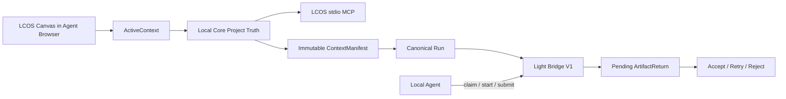

# MVP Agent Context / Bridge V1 主线合并门交付

日期：2026-07-30  
Branch：`codex/mvp-fast-build`  
基线：`d233dd9`

## 任务摘要

本轮把已有 MVP Runtime 闭环升级为本地 Agent 可正式接入的 MVP：

```text
LCOS Canvas / Project Truth
→ ActiveContext
→ LCOS Project MCP / CLI / Skill
→ Light Bridge V1 pull Task
→ Local Agent claim / start / submit
→ ArtifactReturn
→ Accept / Retry / Reject
```

## 实际范围

### 已完成

- Light Bridge Kernel 由 v0.1 升级到 v0.2.0。
- 新任务只使用 `bridge-task-v1`；旧 v0 Task 仅保留读取和完成兼容。
- Output Intent 支持 `create / revise / analyze`；当前 LCOS MVP Run 接入
  `revise`，隔离输出且不覆盖源文件。
- Bridge Provider 采用 pull 模式，本地 Agent 可通过 REST、MCP 或 CLI 主动取件。
- Local Core 默认连接 `127.0.0.1:43122/mcp`。
- 新增 LCOS CLI、stdio Project MCP 和 Project Context Skill。
- 新增 ActiveContext 投影与 Agent Browser Context Surface。
- 飞书链接生成带 provider/resource type/url/purpose 的 `.link.md` Artifact。
- Canvas 显式 Context Artifact 会冻结进 ContextManifest。
- 修复历史 orphan Scope 导致 Runtime Canvas 节点消失的问题。

### 明确未做

- 不引入 tldraw 或第二张 Canvas；Cowart 式能力由“同一 LCOS Canvas +
  Project MCP + ActiveContext”实现。
- 不抓取私有飞书正文，不保存 OAuth/Cookie；只有获得独立授权工具后 Agent
  才能声称读过页面。
- ActiveContext 的即时 selection 目前是进程内投影；可恢复的 Workspace Focus
  仍来自 Project Truth。本轮没有 Schema Migration。
- 未做多 Agent 自由编排、Watcher、自动 Accept 或源文件覆盖。

## 变更流程



## 主要修改文件

- `apps/local-core/src/active-context-store.ts`
- `apps/local-core/src/server.ts`
- `apps/local-core/src/context-manifest-service.ts`
- `apps/local-core/src/runtime-adapter.ts`
- `apps/local-core/src/bridge-mcp-client.ts`
- `apps/local-core/src/runtime-result-ingestion.ts`
- `apps/web/src/App.tsx`
- `apps/web/src/runtime/localCoreClient.ts`
- `apps/web/src/runtime/runtimeBridge.ts`
- `apps/web/src/v071.css`
- `packages/contracts/src/index.ts`
- `packages/skills/lcos-project-context/SKILL.md`
- `tools/lcos-agent/`
- `tools/light-bridge-kernel/`
- `scripts/light-bridge.mjs`
- `scripts/light-bridge-canary.mjs`

## 验证结果

| 验证 | 结果 |
|---|---|
| Web / Local Core Lint | PASS，无 error；保留既有 warning |
| 全 workspace TypeScript typecheck | PASS |
| Runtime / Context / Web 定向 Vitest | PASS，33/33 |
| Light Bridge Pytest | PASS，26/26 |
| Web production build | PASS |
| LCOS MCP initialize + tools/list | PASS，8 个工具 |
| `npm run bridge -- doctor` | PASS，Bridge 0.2.0 / V1 / pull |
| Light Bridge V1 Canary | PASS |
| `git diff --check` | PASS |

### 真实 Canary

```text
Run
→ bridge-task-v1
→ claim-next
→ running
→ bridge-result-v1
→ Bridge stop/start
→ same taskId recovery
→ Local Core sync
→ pending ArtifactReturn
→ Accept
→ new Current Revision
```

证据：

```text
runId: run-f51e2e0d-be52-4dbf-8085-7577cc803ae7
taskId: task-dd6d612b-d4c6-5321-b940-ba303214fae3
Bridge: 0.2.0 / bridge-task-v1
ArtifactReturn: adopted
evidenceRoot:
%TEMP%\lcos-light-bridge-canary-kNdAsc
```

## 浏览器证据

测试流：

```text
?agent=1&project=disposable-mvp-sample
→ 页面显示 Agent Context
→ Workspace 切换：Context v1 → v2
→ 历史 Scope 兼容后：0 Views → 5 Views
→ 定位内容
→ 点击 Thinker_Concept_V3.pptx
→ Context v5 / Selection 1 / Artifact title 可见
```

- 页面标题：`Local Creative OS`
- DOM：Agent Context、Project、Workspace、Selection 均存在。
- 控制台：0 error，0 warning。
- 截图：本次 Codex Browser 会话 `LCOS Agent Context QA`。

## 风险与回滚

- ActiveContext selection 重启后会由当前 Canvas/Workspace 再次投影；不是新的
  SQLite Truth。若产品要求“恢复上次瞬时多选”，需要单独评审 Schema。
- Bridge Python 环境仍需显式配置；`scripts/light-bridge.mjs` 不会自动下载依赖。
- 飞书私有内容读取依赖后续授权 Connector/浏览器能力。

回滚：

1. 删除 `tools/lcos-agent` 与 `packages/skills/lcos-project-context` 可独立撤销
   Agent 入口。
2. 删除 ActiveContext route/surface 不影响 Project Graph。
3. 将 Local Core endpoint 指回旧 Bridge 可回退执行器，但不得把 V1 Run 静默双发。
4. Web Scope 归一只发生在投影层，可单独撤销，不改数据库。

## 主线合并判断

本轮目标涉及的阻塞项已经闭环，可进入提交与主线合并评审。合并前仍需由 Dz 明确
批准 Commit；本轮不自动 Push。
