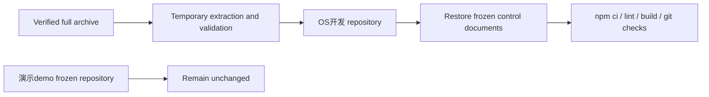

# Local Creative OS Repository Establishment Report

> 日期：2026-07-19  
> 新仓库：`E:\Codex 项目\OS开发`  
> 冻结旧仓库：`E:\Codex 项目\演示demo`

## 1. 任务摘要

从完整 AdFrame Script Review 归档恢复 Git 历史与 Prototype 源码，在本轮文档所在目录建立新的 Local Creative OS 开发仓库，同时保持旧仓库不变。

## 2. 实际范围

- 校验归档 SHA256；
- 在系统临时目录解压并验证 `.git`、HEAD 与关键源码；
- 将完整 Git 历史和 Prototype 文件导入新仓库；
- 保留本轮新版 `README.md`、`AGENTS.md`、`CODEX_START_HERE.md`、`docs/DEVELOPMENT_REQUIREMENTS.md` 与三份审计/提案报告；
- 使用 lockfile 执行 `npm ci`；
- 运行现有 lint、TypeScript/Vite build 与 Git whitespace 检查；
- 未迁移到 `apps/`，未改 Prototype 源码，未提交、Tag、Push 或切换分支。

## 3. 变更流程

## 4. Git 与归档证据

| 项目 | 结果 |
|---|---|
| 归档 | `AdFrame_Script_Review_Day3_2026-07-19.zip` |
| SHA256 | `3027E903C0A97B4812C8E3EDD2D790BB7626A40E122798E4EA4A89D10CB0E17B` |
| 归档条目 | 431 |
| 导入 HEAD | `2a526f833f76d5f441bca81426ddbae9316a082f` |
| 当前分支 | `refactor/reusable-review-core` |
| 旧仓库状态 | 干净，未修改 |
| 新仓库状态 | 基线材料已审查，纳入 `v0.4-local-creative-os-baseline` 基线提交 |

## 5. 主要文件

恢复自归档：

- `.git/`
- `package.json`、`package-lock.json`
- TypeScript/Vite 配置
- `src/`、`public/`
- 旧 Prototype 文档与 QA 证据

保留自本轮新开发包：

- `README.md`
- `AGENTS.md`
- `CODEX_START_HERE.md`
- `docs/DEVELOPMENT_REQUIREMENTS.md`
- `docs/audit/CURRENT_REPOSITORY_BASELINE.md`
- `docs/architecture/CURRENT_TO_TARGET_ARCHITECTURE.md`
- `docs/handoffs/SPRINT_0_PROPOSAL.md`

## 6. 命令与真实结果

| 命令 | 结果 |
|---|---|
| `npm ci` | 通过；安装 28 packages；0 vulnerabilities |
| `npm run lint` | 通过；Oxlint 无错误 |
| `npm run build` | 通过；`tsc -b && vite build`；1782 modules |
| `npm run typecheck` | 不存在；TypeScript 编译包含在 build 中 |
| `npm run test` | 不存在 |
| `npm run smoke` | 不存在 |
| 敏感模式扫描 | 未发现疑似真实凭证值 |

## 7. 已完成、未完成与验证边界

已完成：

- 新仓库具备完整旧 Git 历史与可构建 Prototype；
- 新版冻结文档和 Sprint 0 报告进入同一工作区；
- 旧仓库未改变；
- 依赖、lint、build 当前可复验。

未完成：

- 基线提交与 `v0.4-local-creative-os-baseline` Tag 由本阶段创建；
- 尚未执行目录迁移或 Review feature 抽取；
- 尚未补齐独立 typecheck、unit test 与 smoke；
- 尚未执行浏览器手工 Golden Path；
- Local Core、Canvas、Runtime、SQLite 和 Bridge 均未开发。
- 临时导入目录 `C:\Users\1\AppData\Local\Temp\local-creative-os-import-236b2d1495934a5881c0118534a50eca` 的递归清理被执行安全策略拒绝；目录位于系统 Temp，不在任一仓库中。

## 8. 风险

- 当前分支名仍来自旧 Prototype，不能误解为未来正式 Sprint 分支；
- 旧 App 仍位于根 `src/`，只是受保护的 Review Prototype，不是目标 App Shell；
- 新旧 README/AGENTS 已选择新版控制文档，旧版本仍可通过 Git 历史查看；
- 自动测试和 smoke 门仍缺失。
- 系统 Temp 中残留一份导入暂存副本，不影响仓库，可由系统清理。

## 9. 回滚

- 旧仓库和完整 ZIP 均未修改，是独立恢复源；
- 新仓库尚无新提交，若需放弃应先保存本轮报告，再由用户明确授权删除或重建；
- 不使用 `git reset --hard`，不清理未知文件，不覆盖旧仓库。

## 10. 下一步

基线提交与 Tag 完成后，继续执行已获批准的 Sprint 0 质量门补齐；不进入目录迁移或产品功能开发。
