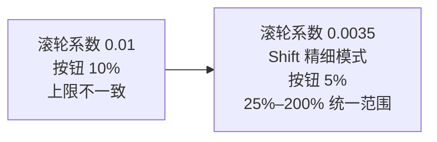

# Run 方案、MVP 架构审核与 Canvas 缩放交付

## 任务摘要

- 输出 Run Output Intent 跨端改造方案。
- 输出当前 MVP 总架构审核。
- 直接修复 Canvas 缩放灵敏度与粗档位问题。
- 本轮不修改 Run Domain、Schema、Bridge 合同或执行路径。

## 实际范围

### 文档

- `docs/architecture/LCOS_RUN_OUTPUT_INTENT_REDESIGN_PROPOSAL_20260730.md`
- `docs/architecture/LCOS_RUN_OUTPUT_INTENT_REDESIGN_PROPOSAL_20260730.docx`
- `docs/audit/LCOS_CURRENT_ARCHITECTURE_AUDIT_20260730.md`
- `docs/audit/LCOS_CURRENT_ARCHITECTURE_AUDIT_20260730.docx`

### 缩放

- `apps/web/src/features/canvas/canvasGeometry.ts`
- `apps/web/src/features/canvas/ProjectCanvas.tsx`
- `apps/web/src/features/canvas/CanvasMiniMap.tsx`
- `apps/web/src/foundation.css`
- `apps/web/tests/canvasGeometry.test.ts`

## 变更流程

按钮缩放和重置以可用 Canvas 视口中心为锚点。滚轮缩放继续以指针为锚点。高频 Wheel 已由既有 `requestAnimationFrame` 合并，不新增全局状态订阅。

## 验证

- `npm exec vitest run apps/web/tests/canvasGeometry.test.ts apps/web/tests/v06RunConfirmation.test.ts`
  - PASS：2 files / 16 tests。
- `npm run typecheck --workspace=@local-creative-os/web`
  - PASS。
- `git diff --check`
  - PASS。
- 浏览器：
  - 页面、Canvas、小地图非空；
  - Console error/warn：0；
  - `82% → +5% → 87% → -5% → 82% → reset → 100%`；
  - 百分比按钮无裁切。
- DOCX：
  - Run 方案：190 paragraphs / 1 table / 1 section；
  - 架构审核：189 paragraphs / 7 tables / 1 section；
  - OOXML 结构检查通过；
  - 当前环境缺少 LibreOffice，未完成 PNG 渲染视觉门。

## 风险

- `25%` 以下的极远总览不再开放；这是为了避免节点小到不可用。300+ 节点总览未来应由聚合/LOD 解决，而不是继续无限缩小。
- Run 方案涉及 Migration v7、Target nullable、多 ArtifactReturn，仍属于红区；必须经前端与 Bridge 后端共同确认后才能实施。
- 架构审核冻结于 `b2b2633`，不把本轮缩放补丁混入基线事实。

## 回滚

- 缩放回滚只需恢复上述五个 Web 文件。
- 文档是新增文件，可独立删除，不影响运行。
- 本轮未执行 Migration、未改变数据库、未修改 Bridge Runtime。
