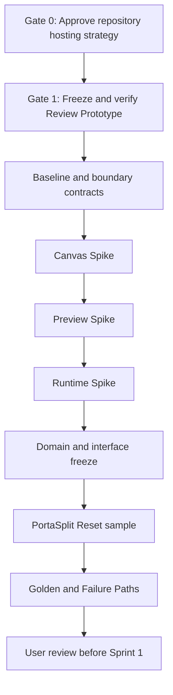

# Sprint 0 Proposal

> 提案日期：2026-07-19  
> 状态：**待用户批准**  
> 本文件不是开发授权；当前仓库完整性 Gate 未通过。

## 1. Sprint 0 目标

Sprint 0 只建立可信、可回滚、可测量的开发基线，并用隔离 Spike 验证 Alpha 主链的关键技术风险。不开发完整 App Shell，不连接生产 API，不引入未经批准的产品范围。

旧 Prototype 已定位于 `E:\Codex 项目\演示demo`，且 lint/build 当前通过；但 `E:\Codex 项目\OS开发` 仍不是 Git 仓库。Sprint 0 必须以“确认仓库承载策略并保护 Prototype”为 Gate 0；Gate 0 未获用户批准时，后续任务全部暂停。

## 2. 范围

严格限定为：

- 保护稳定 Prototype；
- 建立目录与边界；
- 补齐开发基线；
- Canvas Spike；
- 文件 Preview Spike；
- Runtime Spike；
- 数据 / 接口合同；
- PortaSplit Reset 样例；
- Golden Path / Failure Path。

明确不包含：完整 App Shell、真实产品迁移、MCP 产品化、SQLite 全量接入、依赖大升级、飞书/Notion/Buddy 深度接入、Electron/Tauri、提交/Push/Tag/Branch（除非另行明确授权）。

## 3. 建议顺序与 Gate

推荐执行顺序：**仓库承载决策 → Prototype 保护 → 补齐基线/合同 → Canvas → Preview → Runtime → 合同冻结 → 样例与路径验收**。

## 4. 任务拆分

### S0-00：确认仓库承载与安全基线

**目标**：由用户批准以下之一：A）旧仓库原位演进；B）从完整归档建立新 Git 仓库；C）在 `OS开发` 初始化后以可审查方式导入。默认建议 B，旧仓库继续作为冻结源。

**动作**：只读执行 Git 四项检查、目录/依赖/配置/秘密/未跟踪文件审计；确认当前分支与稳定点。

**预计修改文件**：仅更新审计报告；不改代码。

**依赖**：用户选择承载方案；任何复制、初始化或 Git 操作另行授权。

**验收**：`.git`、源码、package/lockfile、测试与旧 Prototype 均可定位；工作区状态明确且无未知秘密。

**回滚**：无代码变更。

### S0-01：保护稳定 Prototype

**目标**：证明旧 Review Prototype 在迁移前可运行、可复验、可回退。

**动作**：运行现有命令；记录页面/Reset/localStorage/Compare/Export/Handoff 基线；建立冻结点仅在用户另行授权后执行。

**预计修改文件**：`docs/audit/*`、`docs/qa/*`；若授权，可能只增加测试证据，不改产品逻辑。

**依赖**：S0-00；现有依赖可安装；用户对 tag/branch/commit 单独授权。

**验收**：现有 lint/build/smoke 真实通过，Prototype 行为有截图或日志证据。

**回滚**：文档可删除；Git 操作只采用可审查策略，不重写历史。

### S0-02：建立目录与边界提案

**目标**：形成文件级 KEEP/MOVE/ARCHIVE 清单与模块依赖图，不立即大搬迁。

**动作**：定位 Review、Domain、Repository/Evaluator/Runtime、seed、CSS、localStorage、导出、Mock/CopyOnly；估算修改文件数。

**预计修改文件**：`docs/audit/PROJECT_FILE_AUDIT.md`、`docs/handoffs/LOCAL_PROJECT_REORGANIZATION_PLAN.md`。

**依赖**：S0-01。

**验收**：每个移动项有来源、目标、import 影响、测试和回滚；超过 25 个业务文件则重新审批。

**回滚**：此阶段只产出计划。

### S0-03：补齐开发基线

**目标**：让根命令真实覆盖 `lint → typecheck → unit test → build → smoke`，并建立秘密与环境配置规则。

**预计修改文件**（待真实仓库确认）：根 `package.json`、现有 package 配置、TS/Vite 配置、测试配置、`.gitignore`、`.env.example`、CI 或 smoke 脚本、README。

**依赖**：S0-02 方案批准；不得为了通过而升级主要框架。

**验收**：五项命令均存在且给出真实结果；失败基线被诚实记录。

**回滚**：逐文件 revert；不改 lockfile 除非获批且有必要。

### S0-04：Canvas Spike

**目标**：验证 `@xyflow/react` 候选方案在冻结 LOD 与交互规则下的性能，不实现产品 App Shell。

**范围**：0–80 完整、81–150 简化、151–300 聚合、300+ 总览；节点 memo；viewport/hover/selection 不触发全图业务重渲染；最多 2 条持续动效；相机移动降级；Portal Overlay 不进布局。

**预计修改文件**：建议隔离于 `labs/canvas-spike/*` 或获批等价目录，包含 fixture、benchmark、README 与结果报告。

**依赖**：基线完成；新增依赖需单独批准并锁定版本。

**验收**：记录设备/浏览器/节点数/FPS/交互延迟/内存；满足预算或给出明确降级点。

**回滚**：删除隔离 Spike 目录及对应依赖变更，不影响 Prototype。

### S0-05：文件 Preview Spike

**目标**：验证 Windows 上 MD、图片、PPT 的可恢复渐进预览链。

**范围**：Thumbnail → Page Preview → Original；内容哈希缓存；PPT 转换失败、文件缺失、权限不足、路径移动；不预生成全部高清页。

**预计修改文件**：`labs/preview-spike/*`、fixture、结果报告；不得写真实项目文件。

**依赖**：明确可用的本地转换工具与许可；临时目录清理策略。

**验收**：三类文件实测；失败可见且不崩溃；临时资源释放；路径与命令参数安全。

**回滚**：移除隔离 Spike 与缓存；原始文件未移动未覆盖。

### S0-06：Runtime Spike

**目标**：验证最小 `Command → Run → waiting_input/review → changed_files/artifacts → Accept/Retry` 真实闭环。

**范围**：Bridge/Runtime Adapter 合同、取消、重试、结构化错误、目标哈希记录与写前复核；不让 CopyOnly/Mock 冒充真实能力。

**预计修改文件**：`labs/runtime-spike/*`、Runtime contract 草案、fixture、事件日志与结果报告。

**依赖**：可用 Codex 执行通道；真实项目 sandbox；安全写入边界。

**验收**：至少完成单文件真实改动、一次 `waiting_input`、Changed Files 回传、Accept/Retry；外部修改进入冲突路径。

**回滚**：仅在 sandbox 中执行；恢复 fixture 或移除 Spike，不覆盖 Prototype。

### S0-07：数据与接口合同冻结

**目标**：冻结 Alpha 最小 Domain、Schema、REST/SSE、Runtime/Preview/Version 合同，不提前搭建完整平台。

**预计修改文件**：`docs/architecture/ERD.md`、`SCHEMA.md`、`API_CONTRACTS.md`、`RUNTIME_CONTRACT.md`，以及获批的 `packages/domain` / `packages/contracts` 纯类型。

**依赖**：三类 Spike 结果。

**验收**：Project、Workspace、Artifact、ArtifactView、ArtifactRevision、Relation、Note、Command、Conversation、Run、ContextSnapshot、SkillRef、Checkpoint、SourceSnapshot 单一来源；`schemaVersion` 与 migration/rollback 明确；无重复领域类型、无 `any`。

**回滚**：合同版本化；未产品化的数据 schema 不迁移用户数据。

### S0-08：PortaSplit Reset 样例

**目标**：建立明确标为 Sample/Fixture、可确定性 Reset 的 Alpha 样例，不把旧 seed 当真实项目。

**预计修改文件**：`projects/fixtures/portasplit/*` 或获批等价目录、reset 脚本、fixture manifest、预期快照。

**依赖**：合同冻结；不得引用机器绝对路径或秘密。

**验收**：重复 Reset 结果一致；Source/Draft/Run/Decision 可区分；不覆盖用户文件。

**回滚**：整个 fixture 可删除并重建。

### S0-09：Golden Path / Failure Path

**目标**：把验收路径变成可重复脚本和人工 checklist。

**Golden Path**：打开 Project → 恢复 Workspace → 拖入文件 → 状态/关系 → Preview/Note → Command/Context → Run → waiting_input → review → Artifact Return → Accept/Retry → Checkpoint → 重启恢复。

**Failure Path**：文件缺失、Preview 失败、Bridge 断线、Codex 不可用、文件冲突、无权限、自动归位失败、SQLite migration 失败、本地路径变化、磁盘不足。

**预计修改文件**：`docs/qa/GOLDEN_PATH.md`、`docs/qa/FAILURE_PATHS.md`、现有测试/smoke 脚本与证据目录。

**依赖**：S0-04 至 S0-08。

**验收**：每条路径有前置、步骤、预期、真实结果和证据；Mock/未接通项明确标记。

**回滚**：测试与文档可单独 revert，不改变用户数据。

## 5. 预计影响模块

在真实仓库未确认前只能给出模块级预测：根工程配置、Web Review 边界、纯 Domain/Contracts、隔离 Labs、测试与 QA 文档。禁止提前承诺具体文件数；S0-02 必须给出真实文件级清单，若明显超过预期则停止审批。

## 6. 总体依赖

- 用户提供/确认真实 Git 仓库；
- 可用且可回滚的 Prototype 基线；
- Windows 上浏览器与 PPT Preview 转换链；
- 可用 Codex/Bridge 测试通道及隔离 sandbox；
- 对新增依赖、Git tag/branch/commit 的逐项授权。

## 7. 主要风险

1. 双目录/双仓库策略不清导致历史丢失或新旧代码混写；
2. 旧 Demo 与 Review 领域高度耦合，抽取范围超过 25 个业务文件；
3. Canvas 性能目标在普通 Windows 设备上不成立；
4. PPT Preview 工具链不稳定、许可不清或产生不可控临时文件；
5. Runtime 只能复制文本，无法证明真实 changed files/artifacts；
6. 过早引入 SQLite/monorepo/状态管理导致 Spike 变产品化；
7. localStorage 历史数据迁移规则不明确；
8. 文档中的示例绝对路径进入代码；
9. Mock/Placeholder 被误报为完成能力。

## 8. Sprint 0 总体验收

- 真实仓库、分支、历史、稳定 Prototype 与回滚点明确；
- 旧 Prototype 仍可运行，行为无意外变化；
- 五项质量命令均存在并有真实结果；
- Canvas/Preview/Runtime Spike 均有可重复实测和失败证据；
- Domain/Schema/API/Runtime 合同冻结；
- PortaSplit 可确定性 Reset；
- Golden/Failure Path 可执行；
- 无秘密、无机器路径依赖、无静默覆盖；
- 三类 Spike 可独立回滚；
- 用户批准后才进入 Sprint 1。

## 9. 需用户确认项

1. 选择旧仓库原位演进、从完整归档建立新仓库，还是在 `OS开发` 初始化后导入；建议从完整归档建立新的 Local Creative OS 开发仓库，同时保留旧仓库不动；
2. 找回仓库后是否授权创建冻结 tag、整理分支和小提交（本提案不视为授权）；
3. Canvas/Preview/Runtime Spike 的隔离目录命名；
4. 是否允许引入 `@xyflow/react`、ELK、Preview 转换工具等具体依赖；
5. 飞书读取/Snapshot Spike 是否另列后续范围——它出现在 PRD，但不在本轮 `CODEX_START_HERE` 的 Sprint 0 强制清单中；
6. Runtime Spike 可使用的 sandbox 与允许修改的样例文件；
7. SQLite 本轮只做合同/最小 Spike，还是完全延后到 Sprint 1。

## 10. 回滚策略

- Prototype 保护优先，Spike 必须隔离；
- 不用 `git reset --hard`，不清理未知未跟踪文件；
- 已跟踪移动优先 `git mv`，但必须在单独批准的迁移任务中执行；
- 每个 Spike 独立依赖、独立测试、可整体移除；
- Schema 只对 fixture 验证，不迁移真实用户数据；
- 任何测试基线持续失败、核心文档冲突或范围膨胀立即停止。

## 11. 当前决策

当前**不适合开始产品编码**。建议先批准且仅执行 S0-00：确定仓库承载策略；随后执行 S0-01 和质量门补齐，再逐项批准其余 Sprint 0 工作。
