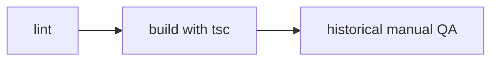
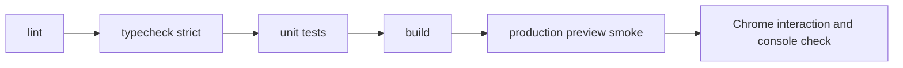

# Sprint 0 Quality Gate Report

> 日期：2026-07-19
> 阶段：新仓库基线与质量门补齐
> 项目：`E:\Codex 项目\OS开发`

## 1. 阶段目标

审查新仓库导入 diff，创建可恢复基线提交与 Tag，并补齐 `lint → typecheck → unit test → build → smoke` 最低质量链。

## 2. 范围

本阶段完成：

- 新仓库 diff、未跟踪文件、秘密模式、依赖与 Git 审查；
- Local Creative OS 基线提交与 Tag；
- 独立 typecheck、unit test、build、production preview smoke；
- Chrome 页面身份、非空首屏、Console 与一次核心交互验证；
- TypeScript strict mode 显式开启。

本阶段未做：

- `apps/` / `packages/` 目录迁移；
- Canvas、Preview、Local Core、Runtime、SQLite 或 Bridge 开发；
- UI 或业务逻辑修改；
- Push 或远程仓库配置。

## 3. 流程变化

### 变更前

### 变更后

用户主流程与数据流没有变化；本阶段只增加工程验证入口。

## 4. Git 基线

| 项目 | 结果 |
|---|---|
| 基线 Commit | `b1067dc chore: establish Local Creative OS baseline` |
| 基线 Tag | `v0.4-local-creative-os-baseline` |
| 分支 | `refactor/reusable-review-core` |
| 远程仓库 | 无；未 Push |
| 旧仓库 | `E:\Codex 项目\演示demo` 保持干净 |

基线预提交暂存检查发现历史 Markdown 中存在硬换行尾随空格；提交命令链未据此中止，基线仍成功创建。本阶段不重写历史、不大规模格式化旧文档，后续新增/修改文件保持 `git diff --check` 通过。

## 5. 修改文件

- `package.json`：增加 typecheck/test/smoke/check scripts；增加 Vitest 开发依赖；
- `package-lock.json`：锁定 Vitest 4.1.10 及依赖；
- `tsconfig.app.json`：显式 strict；将测试纳入类型检查；
- `tsconfig.node.json`：显式 strict；
- `tests/reviewExports.test.ts`：Handoff 与 Markdown Builder 单测；
- `tests/demoStorage.test.ts`：envelope、损坏回退与 Reset 单测；
- `scripts/smoke.mjs`：启动生产预览并验证 React Root 与构建资源；
- 本报告。

没有修改 `src/` 产品实现。

## 6. 测试结果

| 检查 | 结果 |
|---|---|
| `npm audit` | 通过，0 vulnerabilities |
| `npm run lint` | 通过 |
| `npm run typecheck` | 通过；TypeScript strict |
| `npm run test` | 通过；2 files / 5 tests |
| `npm run build` | 通过；1782 modules |
| `npm run smoke` | 通过；首页和 2 个构建资源可访问 |
| `npm run check` | 完整链通过 |

最初安装 Vitest 4.0.18 时命中一项 critical advisory；未执行 `audit fix --force`，而是升级至已修复的 Vitest 4.1.10，重新审计为 0 vulnerabilities。

## 7. 浏览器验证

目标流：应用加载 → 首屏呈现 → 点击“AI 分析” → Mock Skill 状态出现且无运行时错误。

| 检查 | 结果 |
|---|---|
| URL | `http://127.0.0.1:4173/` |
| Title | `AdFrame Script Review` |
| 非空首屏 | 通过；版本、脚本工作区、评审面板与导出入口可见 |
| Framework Error Overlay | 未发现 |
| Console error/warn | 0 |
| 交互 | “AI 分析”唯一 Tab 点击成功并变为 active |
| 状态证据 | `Mock Skill Analysis` 唯一出现；Product Communication、Platform Fit、Human Revision 可见 |
| 浏览器 | Chrome 插件；in-app Browser 因本机 localhost 隔离无法连接后切换 |
| 新截图 | 未生成；Chrome 截图接口两次超时 |

现有 `docs/qa/day3-1366.png` 与 `docs/qa/day3-1024.png` 是旧 Prototype 的历史视觉基线，本报告不将其冒充本轮截图。本阶段没有 UI 改动。

## 8. 已知问题与风险

- 当前 package 名仍为 `adframe-demo`，应在目录/Workspace 方案获批后统一调整；
- 当前分支名仍是旧 Prototype 分支；
- 单测只覆盖已有纯逻辑边界，不覆盖 React 组件交互；
- smoke 验证 HTTP 与构建资源，不替代未来 Golden Path E2E；
- 没有远程仓库，本地 Git 与外部完整 ZIP 是当前唯一恢复依据；
- Browser 截图接口本轮不可用，因此缺少新截图证据。

## 9. 回滚

- 基线可回到 Tag `v0.4-local-creative-os-baseline`；
- 质量门变更可通过 revert 本阶段提交整体回滚；
- 删除测试和 smoke 不影响 Prototype 业务数据；
- 不使用破坏性 reset，不修改旧仓库。

## 10. 下一步判断

质量门补齐后，可进入 Sprint 0 下一项“保护 Prototype 与文件级边界审计”。尚不建议直接执行 `apps/` 大迁移或产品功能开发；应先形成具体 KEEP/MOVE/ARCHIVE 文件表并获批。
