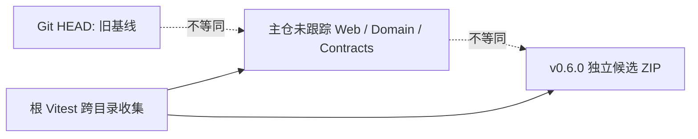
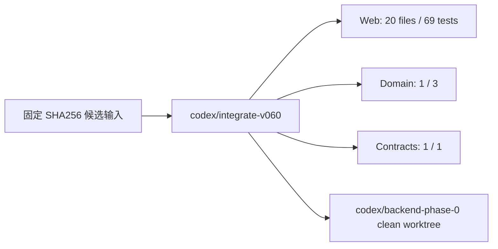

# v0.6.0 Integration Baseline Handoff

> 日期：2026-07-23
> 分支：`codex/integrate-v060`
> 输入：`Local_Creative_OS_v0.6.0_Frontend_Complete.zip`
> 输入 SHA256：`0EEEDB459F3AC778053E2C5885EDD205FDD32208F27D62FCE262C77D5ED40626`

## 任务摘要

将独立 v0.6.0 前端候选包整合为可追溯 Git 基线，隔离根测试发现范围，并为后端建立可复用的干净来源。未修改当前脏工作区，未引入 Local Core、SQLite、Watcher、Bridge 或文件写入。

## 实际范围

- 从 `1f856971e789aac73a84ab4d963d80cf321dfd91` 创建隔离集成 worktree；
- 导入候选 `apps/web`、`packages/domain`、`packages/contracts`、`packages/ui`、`public`、`scripts`、根包配置和 release 文档；
- 保留主仓正式 `README.md`、`AGENTS.md`、`CODEX_START_HERE.md` 与产品文档，不使用候选包精简治理文档覆盖；
- 保留旧根 `src/` Prototype 作为历史可复用来源，但根入口和脚本指向 `apps/web`；
- 将 Web 单测限定为 `apps/web/tests`；
- 根 lint/typecheck/test 显式覆盖 Web、Domain、Contracts；
- 纳入 Backend Takeover Bundle。

## 变更前流程

## 变更后流程

## 用户操作变化

没有产品交互变更；本次将已存在的候选前端落入 Git。根质量命令的输出现在明确区分 Web、Domain、Contracts。

## 数据流变化

无正式数据迁移。候选 `localStorage v9` 仍标记为 Prototype/Fixture，不作为 Local Core schema，不自动迁移。

## 修改文件

- `apps/web/**`
- `packages/domain/**`
- `packages/contracts/**`
- `packages/ui/**`
- `public/icons.svg`
- `scripts/smoke.mjs`
- `index.html`
- `package.json`
- `package-lock.json`
- `docs/release/**`
- `docs/backend-takeover/**`
- 本 Handoff

## 测试结果

| 命令 | 结果 |
|---|---|
| `npm ci` | PASS；63 packages；0 vulnerabilities |
| `npm run lint` | PASS；0 error；Web 7 warning；Domain/Contracts 0 warning |
| `npm run typecheck` | PASS；Web、Domain、Contracts |
| `npm run test` | PASS；Web 20/69，Domain 1/3，Contracts 1/1；合计 22 files / 73 tests |
| `npm run build` | PASS；1802 modules |
| `npm run smoke` | PASS；2 assets，React root present |
| `git diff --check` | PASS；仅 Windows LF/CRLF 提示 |

## 证据说明

测试不再扫描原主仓的 `前端测试/` 展开候选目录。22 files / 73 tests 与独立候选回归报告一致。

## 已知风险

- lint 仍有候选已知 7 条非阻断 warning；
- v0.6.0 整体仍是 `PARTIAL PASS`：Child Scope 正常链失败，Accept/Checkpoint 未在同一正常链完整证明；
- Candidate 仍使用 localStorage v9 保存 Prototype Graph；
- `apps/local-core` 仍不存在；
- 旧根 `src/` 保留但不是当前 App 入口，后续归档需单独批准。

## 未完成

- 不修复 Child Scope；
- 不修改 Web 业务逻辑；
- 不建立 SQLite / Repository / Runtime；
- 不接 Bridge；
- 不写真实用户文件。

## 回滚

- 本集成位于独立分支/worktree；
- 可通过可审查 revert 回滚基线提交；
- 原脏工作区未被覆盖；
- 不使用 `reset --hard`。

## 下一步

`codex/backend-phase-0` 干净 worktree 已创建并完成冷启动质量链。第一条编码任务按 Takeover 提案保持不变：只读 Local Core health、Project root 校验与 Catalog，不引入 SQLite、Watcher、Bridge 或真实文件写入。
