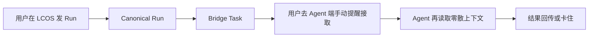
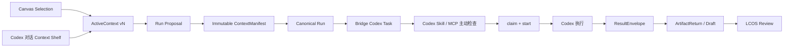

# LCOS Codex Native Loop 合并前完整开发方案

> 版本：v1.0
>
> 日期：2026-08-04
>
> 基线：`v0.7.3 / codex/backend-hardening-20260802 @ 40855ba`
>
> 执行方：WorkBuddy / Buddy 开发会话
>
> 目标：完成 Codex 派单接单与内置浏览器视觉上下文双闭环，通过验收后并回主线。

## 1. 主线冻结结论

本轮合并前开发只服务两个核心方向：

1. **Codex 派单接单闭环**：LCOS 创建 Canonical Run，Bridge 创建唯一 Codex Task，Codex 通过 LCOS MCP / CLI 主动认领、读取、执行并回传结果；
2. **Codex 内置浏览器实时上下文交互**：用户在 LCOS Canvas 与对话框上方直接管理 Target / Context，Codex 始终读取同一份 ActiveContext Truth，并可提出可确认的上下文修改建议。

WorkBuddy 因当前软件开放度不足，退出本轮关键路径：

- 不要求 WorkBuddy 零点击接单；
- 不以 WorkBuddy Conversation Resume 作为验收；
- 不删除 WorkBuddy Provider Adapter；
- WorkBuddy 只做兼容回归，不阻塞合并。

## 2. 合并目标

完成后，用户应能在 Codex 的本地会话与内置浏览器中完成：

```text
打开 LCOS 项目
→ 在 Canvas 选择目标与参考
→ 在节点下方或 Codex 对话框输入要求
→ Codex 读取同一 ActiveContext
→ Codex 认领 Run 并执行
→ 结构化结果回到 LCOS
→ 用户在 LCOS Review
```

本轮合并不要求生产级无人值守桌面自动化，但必须满足：

- 用户不需要复制 Task ID；
- 用户不需要进入 Bridge CLI 执行 claim/start；
- 用户不需要手工拼 Context 文件；
- Codex 在已激活的项目会话中可以主动检查待办；
- Canvas Context 修改能在 1 秒内被 MCP 读取；
- Agent 不得静默扩大上下文；
- Running Run 的 ContextManifest 不随实时 Selection 偷偷变化。

## 3. 现实能力边界

### 3.1 本轮所称“主动接单”

主动接单是指：

```text
Codex 会话已经运行并绑定 LCOS Project
→ Skill 在会话开始、用户发言后或执行完成后检查待办
→ MCP claim_lcos_task 原子认领
→ MCP start_lcos_task 开始执行
```

它不等于：网页在没有模型回合时，凭空唤醒 Codex Desktop 开始生成内容。

在 Codex 平台没有提供正式后台唤醒 API 前，不得宣传：

```text
完全无人值守
关掉 Codex 后仍会自动执行
网页可以自行启动一个 Codex 对话
```

### 3.2 实时上下文

实时指：ActiveContext 的选择、Target、Pinned、Excluded、Workspace 与版本变化可被 Web 和 MCP 在 1 秒内读取，并带稳定 `version`。

不代表 Running Run 会实时追加 Context。Run 创建时仍冻结不可变 ContextManifest。

## 4. 变更前后流程

### 4.1 变更前



### 4.2 变更后



## 5. 架构边界

```text
Web
= 可视选择、Context Shelf、浏览器 Agent Surface、状态反馈

Local Core
= ActiveContext Truth、ContextManifest、Canonical Run、Artifact/Revision Truth

Light Bridge
= Codex Provider Task、原子 Claim、Task 状态、ResultEnvelope

Codex MCP / CLI / Skill
= 项目绑定、待办检查、Context 读取、执行、结果提交

Codex 内置浏览器
= LCOS 的视觉上下文表面，不是项目真相源
```

禁止：

- Web 直接调用 Bridge `create_task`；
- Codex 直接读取 SQLite；
- Codex 绕过 Local Core 修改 `currentRevisionId`；
- Browser 页面执行 Shell；
- 将 ActiveContext 保存在 localStorage 作为 Truth；
- 将浏览器 DOM 当作唯一 Agent Context；
- 为了唤醒 Codex 模拟键鼠或注入对话。

## 6. 必须冻结的 Contract

### 6.1 ActiveContextV2

建议从现有 ActiveContextProjection 版本化，不重复创建第二套 Selection：

```ts
interface ActiveContextV2 {
  schemaVersion: 2
  projectId: string
  workspaceId: string | null
  scopeId: string | null
  selectedViewIds: readonly string[]
  targetArtifactId: string | null
  targetRevisionId: string | null
  pinnedContextIds: readonly string[]
  excludedContextIds: readonly string[]
  contextItems: readonly AgentContextItem[]
  version: number
  updatedAt: string
  updatedBy: 'web' | 'codex' | 'core'
}
```

规则：

- `version` 单调递增；
- PUT 支持 `expectedVersion`，冲突返回 409；
- Codex 只能提交 Proposal，用户确认后才能扩大 Context；
- Target 与 Context 分开；
- ContextItem 只包含受控摘要、Artifact/Revision ID 和预览引用，不泄露任意绝对路径。

### 6.2 ContextChangeProposalV1

Codex 建议加入或移除 Context 时使用：

```ts
interface ContextChangeProposalV1 {
  proposalId: string
  projectId: string
  baseContextVersion: number
  addViewIds: readonly string[]
  removeViewIds: readonly string[]
  targetViewId?: string
  reason: string
  createdBy: 'codex'
  status: 'pending' | 'accepted' | 'rejected' | 'stale'
}
```

### 6.3 CodexTaskV1

继续使用 Bridge Task，但冻结 Codex Profile：

```text
provider = codex
projectId
lcosRunId
contextManifestId
taskType
outputIntent
expectedOutputs
targetArtifactId / baseRevisionId（revise 必填）
idempotencyKey
```

Task 中不嵌入整个项目，也不传 Runtime Root 给模型。

### 6.4 ResultEnvelope

本轮至少支持：

```text
analyze → zero-file structured reply
create → one or more new files
revise → target-bound changed file
```

每个输出必须带 action、canonicalPath、contentHash、mediaType；revise 还必须带 baseContentHash。

## 7. MCP 产品面

必须补齐或确认以下工具：

```text
bind_lcos_project
get_lcos_active_context
watch_lcos_active_context
propose_lcos_context_change
accept_lcos_context_proposal
list_lcos_pending_runs
claim_lcos_run
start_lcos_run
get_lcos_run_context
heartbeat_lcos_run
submit_lcos_result
fail_lcos_run
inspect_lcos_run
```

### MCP 规则

- `claim_lcos_run` 必须原子、幂等并校验 Provider；
- `get_lcos_run_context` 返回冻结 Manifest，不返回实时 ActiveContext；
- `watch_lcos_active_context` 可用 SSE 或基于 version 的 long poll；
- Tool 错误必须结构化，不能只返回自由文本；
- Tool 描述明确 Project Truth、Run Truth 与 Provider Task 的边界；
- 所有写操作只通过 Local Core / Bridge 正式 Service。

## 8. Codex Skill 行为

更新 `tools/lcos-agent/skills/lcos-project-context`：

### 会话绑定

首次进入项目：

1. 调用 `lcos doctor`；
2. 绑定明确 `projectId`；
3. 读取 ActiveContext；
4. 告知用户当前 Target 与 Context；
5. 检查 Codex Provider 待办。

### 主动检查时机

- 会话首次绑定后；
- 用户每次发言后；
- 完成一个 LCOS Run 后；
- 用户明确说“接单”“继续 LCOS”“同步画布”时。

禁止无限后台轮询。一次 Agent 回合最多检查一次；执行中的 Run 使用有界 Heartbeat。

### 执行纪律

- 先 Claim，再 Start；
- 读取冻结 Manifest；
- 修改前校验 Target/Base；
- 结果写入 Staging；
- 提交 ResultEnvelope；
- 不自动 Accept；
- 遇到歧义返回结构化失败或 InputRequest，不自行扩大 Context。

## 9. 内置浏览器视觉上下文方案

### 9.1 页面模式

新增明确的 Agent Surface 模式，例如：

```text
http://127.0.0.1:5173/?agent=codex&project=<id>
```

页面仍是正式 LCOS Web App，不创建第二套 Agent 专用 Graph。

### 9.2 对话框交互

对话输入区上方显示：

```text
[Target: Script.md] [Reference: Feedback] [Reference: Brief] [+ 添加]
```

交互规则：

- 单击 Canvas 节点立即更新 Selection；
- Target 使用独立标识，不允许当作普通参考移除；
- Reference 可直接移除；
- `+` 打开轻量节点选择器，支持当前 Workspace 搜索；
- Codex 建议加入节点时显示 Proposal Chip，用户点确认后生效；
- Context 变化显示同步状态：同步中 / 已同步 vN / 冲突；
- Run 发起后 Shelf 锁定为 Manifest Snapshot，继续修改只影响下一次 Run。

### 9.3 实时同步

建议实现 Local Core SSE：

```text
GET /projects/:projectId/active-context/events?afterVersion=N
Content-Type: text/event-stream
```

事件：

```text
active_context.updated
context_proposal.created
context_proposal.resolved
run.created
run.status_changed
artifact_return.created
```

若本轮不批准 SSE Schema，可先使用 500–1000ms version poll，但合并前必须压测并记录资源占用。不得同时保留两套长期实现。

### 9.4 Cowart / tldraw 式能力的本轮边界

本轮实现：

- Codex 读取节点 ID、标题、类型、Revision、关系摘要和 Preview 引用；
- Codex 可请求定位节点、聚焦 Workspace、建议增删 Context；
- 用户视觉选择变化即时进入 ActiveContext；
- Codex 和 GUI 使用同一 Context version。

本轮不实现：

- Agent 任意拖动或重排 Canvas；
- Agent 直接修改节点视觉坐标；
- 浏览器像素级截图作为唯一 Context；
- 多人实时协同光标；
- 远程浏览器控制或网页抓取平台。

## 10. 分片施工计划

### Slice C0：基线与合同冻结

目标：不写功能，先冻结双闭环合同。

修改：

- `packages/contracts`；
- `docs/architecture`；
- `docs/handoffs`；
- Contract Tests。

交付：

- ActiveContextV2；
- ContextChangeProposalV1；
- CodexTaskV1 Profile；
- MCP Tool 表；
- 状态、错误码、权限边界；
- 变更前后流程和回滚。

Commit 建议：

```text
docs(runtime): freeze Codex native loop contracts
```

停止门：Contract 与当前 v13 Schema 冲突时停止，不自行 Migration。

### Slice C1：Codex MCP 读链

目标：Codex 稳定读取 Project、Selection、ActiveContext 和冻结 Manifest。

修改：

- `tools/lcos-agent/mcp-server.mjs`；
- `tools/lcos-agent/lib/client.mjs`；
- `tools/lcos-agent/cli.mjs`；
- Local Core read API；
- MCP/CLI tests。

验收：

- GUI 选择变化后 1 秒内 MCP 返回新 version；
- Running Run 始终返回原 Manifest；
- 中文路径与长标题不破坏 JSON；
- Codex 不需要读取 SQLite。

Commit：

```text
feat(agent): expose versioned LCOS context to Codex
```

### Slice C2：Codex Claim / Start / Heartbeat

目标：已绑定 Codex 会话无需用户操作 Bridge CLI 即可接单。

修改：

- Bridge Codex provider profile；
- MCP claim/start/heartbeat；
- CLI 等价命令；
- Skill 主动检查规则；
- Lease/幂等测试。

验收：

- 同一 Task 并发 Claim 只有一个成功；
- 重放 Claim 返回同一所有权，不创建新 Task；
- 非 Codex Provider Task 不会被 Codex 认领；
- Bridge 重启后绑定仍可查询；
- Skill 不无限轮询。

Commit：

```text
feat(bridge): add controlled Codex task claiming
```

红区：若需要新增 Lease Schema，先提交 Migration 方案并停下等待批准。

### Slice C3：内置浏览器 ActiveContext Surface

目标：Canvas、节点 Composer、Agent Surface 使用同一 Context Truth。

修改：

- `apps/web` Agent Surface；
- `apps/web` Context Shelf；
- Local Core ActiveContext version / event；
- MCP context watch；
- Browser tests。

验收：

- Canvas 点选、移除、添加 Context 即时同步；
- 页面刷新和 Core 重启后 Context 可恢复；
- 冲突有明确提示，不做 last-write-wins 静默覆盖；
- 不出现隐藏 Context；
- 1366×768 可用，Shelf 不挤压输入框。

Commit：

```text
feat(web): add Codex visual context surface
```

### Slice C4：Codex Context Proposal

目标：Codex 能建议上下文变化，但用户保留控制权。

修改：

- Context Proposal Service；
- MCP proposal tool；
- Web Proposal Chip；
- stale/version tests。

验收：

- Codex Proposal 不会直接改变 ActiveContext；
- 用户 Accept 后 version +1；
- Reject 保留审计但不改变 Context；
- baseVersion 过期标记 stale；
- Running Manifest 不受影响。

Commit：

```text
feat(context): add reviewable Codex context proposals
```

### Slice C5：Result 回收最小闭环

目标：Codex 完成 analyze/create/revise 后结果真实回到 LCOS。

本轮合并门只要求：

- analyze：结构化回答；
- create：新 Markdown Artifact；
- revise：现有 Markdown 的 Draft Revision。

必须继续遵守：

- Staging；
- Path Guard；
- content hash；
- revise base hash；
- Accept 前 Current 不变。

Commit：

```text
feat(runtime): close Codex result return loop
```

红区：真实文件覆盖、删除、移动、symlink/junction 与 Accept 语义改变必须停下单独批准。

### Slice C6：合并前 Golden Path

不再扩功能，只修阻塞问题。

真实项目测试：

```text
Run 1：分析 Brief + Feedback
Run 2：创建新 Markdown 提纲
Run 3：修改现有 Script
Run 4：Canvas 增删 Context 后再次修改
Run 5：Bridge/Core 重启后继续完成
```

通过后生成最终 Handoff 与 Merge Checklist。

Commit：

```text
test(e2e): prove Codex native LCOS golden path
```

## 11. 预计修改范围

### 核心文件

- `packages/contracts/src/`；
- `apps/local-core/src/active-context-store.ts`；
- `apps/local-core/src/server.ts`；
- `apps/local-core/src/runtime-adapter.ts`；
- `apps/local-core/src/runtime-result-ingestion.ts`；
- `tools/light-bridge-kernel/src/lcos_bridge/`；
- `tools/lcos-agent/cli.mjs`；
- `tools/lcos-agent/mcp-server.mjs`；
- `tools/lcos-agent/skills/lcos-project-context/`；
- `apps/web/src/App.tsx`；
- `apps/web/src/features/canvas/SelectionComposer.tsx`；
- 新 Agent Context Surface / Activity 组件；
- 对应 unit、integration、architecture、browser、E2E tests。

### 原则上不改

- Workspace 核心语义；
- Artifact / ArtifactView 身份规则；
- 一个 Project 一张 Canvas；
- Revision Current / Draft 基础语义；
- `.lcosproj` 格式；
- Preview Renderer；
- Watcher；
- WorkBuddy Provider 内部实现。

## 12. 测试计划

### Contract

- ActiveContext version 单调递增；
- expectedVersion 冲突；
- Context Proposal stale；
- Codex Task Provider 隔离；
- ResultEnvelope action 校验。

### Integration

- Web PUT → Core ActiveContext → MCP GET；
- GUI Selection → Codex Context；
- Run → Bridge Task → Codex Claim；
- Claim → Start → Result → ArtifactReturn；
- Restart Recovery；
- Bridge Offline；
- Provider 错配；
- 重复 Result。

### Browser

- 单选、框选、切换 Target；
- 添加、移除 Reference；
- Codex Proposal Accept / Reject；
- 同步状态与冲突；
- Run 后 Shelf Snapshot；
- 刷新恢复；
- 1366×768 与大屏。

### Golden Path

- 5 次真实 Codex Run；
- 至少 4 次无需手动 Bridge 操作；
- 5 次 Target / Context 全部正确；
- 无 Task ID 复制；
- 无 Current 静默变化；
- 无 Fixture 静默接管；
- 无孤儿 Bridge/Core；
- `git diff --check`、质量链和 Restart Recovery 通过。

## 13. 合并门

### 必须全部满足

```text
[ ] Codex 是唯一正式合并验收 Executor
[ ] WorkBuddy 不再阻塞主线
[ ] LCOS Run 能产生唯一 Codex Task
[ ] Codex MCP 可列出并原子认领待办
[ ] Codex 可读取冻结 ContextManifest
[ ] Canvas / Composer / MCP 使用同一 ActiveContext version
[ ] Codex 上下文建议必须经用户确认
[ ] analyze/create/revise Markdown 最小结果闭环成立
[ ] Accept 前 Current 不变
[ ] 刷新、Core 重启、Bridge 重启后可恢复
[ ] 5 次真实 Run 至少 4 次成功
[ ] 用户不接触 Task ID、claim、Runtime Root、Staging Path
[ ] 无 Fixture / Mock 冒充 Runtime
[ ] 所有测试与 Handoff 完成
```

### Conditional Go

如果平台无法在无 Agent 回合时唤醒 Codex，但以下条件成立，可以合并：

- 用户已在 Codex 会话中绑定项目；
- Skill 在每个回合主动检查待办；
- 用户无需手工 Bridge 操作；
- UI 诚实标识“等待 Codex 会话响应”，不宣传后台无人值守。

### No-Go

- 仍需复制 Task ID；
- Codex 必须手工运行 claim/start 命令；
- Browser Context 与 MCP Context 不一致；
- Agent 可静默读取 Shelf 外内容；
- Running Run 的 Context 随 Selection 漂移；
- Result 直接覆盖 Current；
- WorkBuddy 限制仍被包装成 LCOS 核心能力。

## 14. Buddy 执行规则

1. 开工前读取 `README.md`、`AGENTS.md`、本方案和最新 Handoff；
2. 先审计当前 MCP / CLI / Bridge 能力，已完成项不重写；
3. 每个 Slice 先列实际修改文件；
4. 一个 Slice 一个小提交；
5. 不自动 Push，不重写历史；
6. 不修改未获批红区；
7. 遇到 Schema、真实覆盖、Accept 语义或 Codex 平台唤醒限制立即停下；
8. 不用 Fixture、定时 Toast 或假状态代替真实链路；
9. 每个 Slice 交付修改文件、测试、真实证据、未完成和回滚；
10. C6 前不做全量美化和无关重构。

## 15. 排期建议

按单线集中开发估算：

- C0：0.5 天；
- C1：1 天；
- C2：1–2 天；
- C3：1.5–2 天；
- C4：1 天；
- C5：1.5–2 天；
- C6：1–1.5 天。

预计 7.5–10 个专注开发日。若现有 Bridge Claim、ActiveContext 和 Result Ingestion 可直接复用，可能压缩到 5–7 日；不得以省略真实测试换取压缩。

## 16. 最终交付

Buddy 完成后必须提供：

- `LCOS_CODEX_NATIVE_LOOP_FINAL_HANDOFF.md`；
- Contract 与状态映射；
- MCP / CLI 使用说明；
- Browser Context 交互说明；
- 5 次真实 Run 证据；
- Restart Recovery 证据；
- 未实现能力清单；
- 合并 Commit 范围；
- 回滚说明；
- 是否满足 Merge Gate 的逐项结论。

满足合并门后，当前重构分支即可并回主线。合并后下一阶段才重新评估 WorkBuddy 自动化、waiting_input、完整 Safe Write、更多 Preview 与 Connector。
