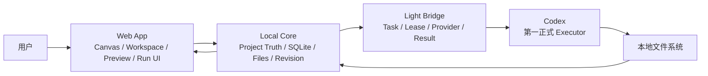

# Local Creative OS 大改后产品说明与主线决策建议

> 面向角色：产品经理、产品负责人、技术负责人
>
> 版本基线：v0.7.3 / `codex/backend-hardening-20260802 @ 40855ba`
>
> 日期：2026-08-04
>
> 文档目的：说明当前产品已经是什么、真实能做什么、尚未完成什么，并为下一阶段主线选择提供决策依据。

## 一、执行摘要

Local Creative OS（LCOS）已经从早期“画布 Demo + Fixture”演进为一个具备本地项目身份、持久化项目图谱、文件导入与预览、Workspace 语义视角、AI Run 合同、Bridge 执行路由、Revision 与 Checkpoint 基础的全栈产品原型。

它的产品定位不是新的内容编辑器，也不是 Agent 聊天壳，而是：

> 让个人创作者在一张持续存在的项目画布上理解资料、组织上下文、向本地 Agent 派发工作，并把文件变化、版本和决策重新归位。

本轮大改解决了三个关键方向：

1. **Project Truth 开始成立**：Project、Workspace、Artifact、View、Revision、Run、Checkpoint 等核心数据由 Local Core 与 SQLite 管理，不再主要依赖浏览器 Fixture。
2. **上下文开始可见**：用户在节点下方能看到 Target 和 Context Shelf；界面展示的参考项才会进入 Run，不再隐藏注入一跳关系。
3. **执行结构开始分层**：LCOS 管 Canonical Run，Bridge 管 Provider Task，Agent 管真实执行会话；Provider 状态不再冒充产品状态。

但当前版本仍不能被定义为“无需照看的完整个人 Creative OS”。最关键的缺口不是再多支持一种文件，而是 Run 发起后的可靠闭环：

- Bridge 在线，但 Agent 自动接单尚未形成统一可复现体验；
- `waiting_input` 只有产品状态，缺少真实提问—回答—继续协议；
- Artifact Return 已有结构，但 Safe Write、冲突处理与 Accept 唯一写入口仍未完全封死；
- GUI 能操作主要路径，但 Activity、失败恢复、功能可发现性仍不完整。

**建议下一阶段主线：Codex Native Loop（Codex 原生执行与视觉上下文闭环）。**

主线只聚焦两个核心结果：

1. LCOS 可以向 Codex 派单，Codex 可以主动接单、读取 ContextManifest、执行并回传结果；
2. LCOS 在 Codex 本地 Agent 的内置浏览器中成为可实时读取和修改的视觉上下文，用户可在对话框上方直接增删 Target / Context，变化即时同步给 Codex。

这两点实现并通过真实项目验证后，即可把当前重构分支并回主线。WorkBuddy 因当前软件开放度不足，降为后续 Provider 兼容方向，不再作为本阶段合并门槛。

暂不把飞书深度写回、更多云 Connector、复杂网页嵌套、完整视频工作流或新编辑器作为主线。先证明用户可以在不理解 Bridge、Task ID 和文件写入规则的情况下，连续完成 5 次真实任务，并安全获得结果。

## 二、产品定义

### 2.1 目标用户

首要用户是单人或小型创意工作者，典型包括：

- AIGC 视觉与内容创作者；
- 广告、品牌、短视频与社交内容从业者；
- 需要同时管理 Brief、参考图、脚本、演示文稿和反馈的个人项目负责人；
- 使用 Codex、WorkBuddy 等本地 Agent，但不希望自己维护命令、上下文文件与结果目录的人。

### 2.2 核心问题

现有创作工具分别管理内容，却缺少一个持续的项目层来回答：

- 当前任务真正参考了哪些资料？
- Agent 修改的是哪个对象、哪个版本？
- 新生成文件和修改原文件分别应该放在哪里？
- 哪次 Run 产生了哪些结果？
- 哪个结果已被接受为 Current，哪个仍是 Draft？
- 关闭工具、移动视角或重启服务后，项目判断还能否恢复？

LCOS 的价值是把这些问题变成产品默认规则，而不是让用户维护 Prompt、路径和 Task ID。

### 2.3 不做什么

LCOS 不取代 Photoshop、Premiere、PowerPoint、Canva、Figma、飞书或 IDE。它不以“内置所有编辑能力”为目标。

它负责看、判断、派活、追踪和归档；专业内容仍在原生工具或 Agent 中生产。

## 三、当前产品结构



### 3.1 Web App

负责用户可见的项目操作：

- Project Drive 与项目标签；
- 单张持续 Canvas；
- Workspace Dock 与语义视角；
- 文件节点、关系、选区与 Mini-map；
- 右侧 Preview / Workbench；
- 节点下方 Context Composer；
- Run 状态、Review、Accept / Reject / Retry 界面；
- Workspace State 与 Checkpoint 操作。

### 3.2 Local Core

负责本地项目真相：

- SQLite 与 Migration；
- Project、Workspace、Artifact、ArtifactView、Relation；
- FileRecord、Observation、PreviewRecord；
- ArtifactRevision、Note、Checkpoint；
- ContextManifest、Canonical Run、RuntimeDispatch、RuntimeBinding、ArtifactReturn；
- 文件导入、目录扫描、路径校验、Watcher 与恢复；
- `.lcosproj` 工程文件的导出、打开和路径重绑定。

### 3.3 Light Bridge

负责执行路由，而不是项目真相：

- 创建、认领、启动、取消与完成 Task；
- Provider Capability；
- Pull Worker；
- changed files 与结构化 Result；
- Codex 的正式执行适配，以及 WorkBuddy 的兼容适配基础。

### 3.4 CLI、MCP 与 Skill

Agent 已具备读取当前项目、Workspace、Selection、Context 和部分 Run/Revision 操作的入口，但操作覆盖仍不完整。它们应继续作为 Agent 产品面，而不是给普通用户暴露的必经步骤。

## 四、当前用户可以完成的真实任务

| 用户目标 | 当前结果 | 成熟度 |
|---|---|---|
| 从已有文件夹创建项目 | 可选择本地目录，建立 Project 身份并导入内容 | 可用，超大目录体验仍需压测 |
| 保存可复用工程身份 | 可导出、打开、重绑定 `.lcosproj` | 可用，长期迁移策略未完成 |
| 在同一画布管理内容 | Artifact 与 View 分离；支持节点、关系、位置与 Workspace | 可用 |
| 把内容加入 Workspace | 支持显式加入、移出、移动；当前 Workspace 仍提供默认归属 | 基础可用 |
| 预览常用文件 | 图片、Markdown、TXT、PDF 等已有不同程度预览；统一 Viewer Host 已建立 | 部分可用，DOCX/PPT 体验不一致 |
| 为节点添加说明 | Note 已成为受管 Text Artifact，可进入 Run Context | 可用 |
| 选择 AI 参考上下文 | Target 与 Context Shelf 可见、可增删，并写回 Local Core | 可用 |
| 创建 Run | 支持 analyze / create / revise、Provider 与结果策略 | 合同可用，体验仍有手动接取缺口 |
| 查看过程 | Canvas 只保留少量真实 Run；Revision 与 Checkpoint 不再伪装成 Run | 可用，完整 Activity 未完成 |
| 回收结果 | Artifact Return、Draft Revision、changed files 结构存在 | 部分可用，Safe Write 尚未封口 |
| 接受或重试结果 | UI 与基础服务存在，Current 生命周期已有保护测试 | 部分可用，唯一写入口仍需运行时 Guard |
| 保存现场并恢复 | Workspace State、Checkpoint、SQLite 重启恢复已有基础 | 可用，失败恢复 UI 不完整 |
| 后台运行服务 | Launcher 管理 Web/Core/Bridge；GUI 关闭后 Core/Bridge 常驻；托盘可重新打开和退出 | 开发宿主可用，尚非安装版产品 |

## 五、大改后最重要的产品进展

### 5.1 从“页面”变成“持续项目”

一个 Project 只有一张持续 Canvas。Workspace 不再被当作页面、目录或另一套 Graph，而是同一项目图谱的语义视角。这让内容身份、关系和历史可以跨 Workspace 保持一致。

### 5.2 从“节点卡片”变成“内容身份 + 视图”

Artifact 是内容身份，ArtifactView 是它在 Canvas 上的呈现。同一个 Artifact 可以出现在不同 Workspace；删除 View 不删除真实内容。这是工程文件、版本与多视角管理能够长期成立的基础。

### 5.3 从“隐藏上下文”变成“所见即所得 Context”

节点下方 Composer 现在把编辑目标和参考上下文明确分开：

- Target 是本次要修改或分析的对象；
- Context 是 Agent 可以读取的参考；
- 系统可以给默认建议，但用户可以移除或补充；
- Run 最终只使用 Shelf 中可见的内容。

这比要求用户先理解 Workspace Membership、Relation 类型或 Manifest 更符合直觉。

### 5.4 从“Bridge Task 就是 Run”变成双层状态

Canonical Run 是 LCOS 的产品状态；Bridge Task 是 Provider 执行状态。两者通过 RuntimeBinding 关联，不共享 Source of Truth。

因此 `assigned`、`review`、`timeout` 等 Provider 术语不会污染 LCOS 的产品状态，也为未来替换 Executor 留出空间。

### 5.5 从“关闭即消失”变成后台宿主

Launcher 已统一管理 Web、Local Core、Bridge 和托盘：

- 关闭 GUI 只停止 Web；
- Core 与 Bridge 继续后台运行；
- 托盘可以重新打开、查看状态、重启和完全退出；
- 日志与 PID 保存在工作树本地运行目录。

当前仍是开发宿主，不是带安装、升级和系统启动策略的正式桌面发行版。

## 六、当前体验仍会卡住的位置

### 6.1 Run 发起后仍可能需要用户去 Agent 端接取

Bridge 已支持 Pull Worker 与 Task 生命周期，但“Bridge 常驻”不等于“Agent 自动执行”。WorkBuddy 当前受软件开放度限制，难以稳定提供实时派单、自动接单和可控恢复，因此不再承担当前主线。

当前应优先打通 Codex：由 LCOS 创建 Canonical Run 和唯一 Provider Task，Codex 通过受控 CLI / MCP 主动领取，读取 ContextManifest 后执行，再提交结构化 ResultEnvelope。普通用户不接触 Task ID、claim、Runtime Root 或 Staging Path。

这是当前最大的产品阻塞。用户不应该理解 Task ID、claim、start 或 inbox 才能完成一次 Run。

### 6.2 Codex 内置浏览器尚未成为实时视觉上下文

LCOS 已有 Canvas Selection、ActiveContext 和可见 Context Shelf，但 Codex 内置浏览器中的页面目前还不是一个完整的双向 Agent Context Surface。

目标交互应接近成熟 AI 创作工具：

- 对话输入框上方直接显示 Target 与参考节点缩略项；
- 用户在 Canvas 选中、加入或移除 Context 后，Codex 立即读取最新版本；
- Codex 可以通过 LCOS MCP 定位节点、读取预览与元数据、提出上下文建议；
- 用户确认 Codex 建议后，LCOS 更新 Shelf，而不是让 Agent直接静默扩大 Context；
- 对话、Canvas、Inspector 和 Run 必须引用同一份 ActiveContext Truth。

这不是把普通网页嵌进 Canvas，也不是让浏览器读取整个项目目录；它是让 Codex 的内置浏览器成为 Cowart / tldraw 式可读、可定位、可交互的项目视觉上下文。

### 6.3 `waiting_input` 尚未形成真实协议

界面和 Canonical Run 已有 `waiting_input` 概念，但 Bridge 与 Provider 之间没有统一的 InputRequest、回答幂等和同 Run Resume 合同。当前不能宣传 Agent 会暂停、向用户提问并原地继续。

### 6.4 文件结果还没有生产级 Safe Write

系统能够隔离 Staging 和创建 Draft，但完整写入仍需要：

- Project Root 与 Staging Root Guard；
- symlink / junction 防穿越；
- base hash 冲突检测；
- 单写租约；
- content hash 与 MIME 校验；
- create / revise / delete proposal 的明确动作；
- Accept 前绝不切换 Current。

### 6.5 Activity 与失败恢复仍不完整

历史 Run 已从 Canvas 移出，但还缺少成熟 Activity 入口承接全部历史、输入请求、恢复动作和错误。用户仍可能只看到“失败”，却不知道应该重连、重新派发还是新建 Retry。

### 6.6 文件预览存在能力不一致

统一 Viewer Host 已有，但图片、文本、PDF、PPT、DOCX 的 Preview 质量和交互仍不一致。预览问题应该作为体验主线的第二优先级，而不是继续堆独立格式实现。

### 6.7 功能可发现性仍弱

部分能力依赖右键、双击、隐藏按钮或快捷键。下一轮 UI 不应再增加更多入口，而应建立：

- 清晰的首次项目引导；
- 统一 Command / Action Menu；
- 选择节点后的就地操作；
- Activity 与 Inspector 的稳定信息架构；
- GUI 与 CLI 能力边界说明。

## 七、产品成熟度判断

| 维度 | 判断 | 说明 |
|---|---|---|
| 产品定位 | 已清晰 | Canvas 型项目 OS，而非编辑器或聊天壳 |
| 核心对象模型 | 基本稳定 | Project、Workspace、Artifact/View、Revision、Run 已分层 |
| 本地持久化 | 基本成立 | SQLite、Migration、`.lcosproj`、Restart 基础存在 |
| 文件输入 | 可用于真实项目试用 | 目录导入与常用文件成立，格式体验不一致 |
| Canvas 组织 | 可用但需体验收敛 | Workspace 与关系成立，功能发现和大图性能仍需完善 |
| Context 构建 | 已具备正确产品形态 | Target + 可见 Context Shelf |
| AI 执行 | 半闭环 | Run/Bridge 成立，自动接单与 waiting_input 未闭合 |
| 结果安全 | 半闭环 | Draft/Return 成立，Safe Write 与 Accept Guard 未完全封死 |
| Agent 产品面 | 部分可用 | CLI/MCP 有基础，覆盖和 Skill 一致性仍需继续 |
| 可发布性 | 尚未达到 | 缺安装、升级、完整失败恢复和长时间稳定性验证 |

当前更准确的阶段定义是：

> **可进行真实项目纵向验证的 Development Alpha，而不是可交付普通用户的 1.0。**

## 八、已冻结的下一主线

下一主线不再做三选一，直接冻结为：**Codex Native Loop**。

### 核心方向一：Codex 派单接单闭环

目标：LCOS 创建 Run 后，已绑定项目的 Codex 会话通过 MCP 主动检查、原子 Claim、读取冻结 ContextManifest、执行并提交结构化结果。

用户不需要理解或操作：

- Bridge Task ID；
- claim / start；
- Runtime Root；
- Staging Path；
- Provider 内部状态。

这里的“主动”有明确边界：Codex 会话已经运行时，Skill 在会话绑定、用户发言后和完成任务后检查待办。当前不承诺网页能在没有模型回合时凭空唤醒 Codex Desktop。

### 核心方向二：内置浏览器视觉上下文闭环

目标：LCOS 在 Codex 内置浏览器中成为可实时读取和交互的 Agent Context Surface。

对话输入区上方直接显示：

```text
[Target: Script.md] [Reference: Feedback] [Reference: Brief] [+ 添加]
```

Canvas、节点 Composer、Inspector 和 Codex MCP 使用同一份 ActiveContext version。用户增删参考后，Codex 在 1 秒内读取变化；Codex 可以提出加入或移除节点的 Proposal，但未经用户确认不得静默扩大 Context。

### WorkBuddy 定位调整

WorkBuddy 保留 Provider Adapter 与兼容回归，但因当前软件开放度不足，不再承担：

- 当前主线自动接单；
- 合并前 Golden Path；
- `waiting_input` Resume；
- 零点击 Executor 宣传。

## 九、合并前推荐路线

1. **C0 合同冻结**：ActiveContextV2、ContextChangeProposalV1、CodexTask Profile、MCP 工具与错误码；
2. **C1 Codex MCP 读链**：Project、Selection、ActiveContext、ContextManifest；
3. **C2 Codex Claim / Start / Heartbeat**：已激活会话主动检查与原子认领；
4. **C3 内置浏览器 Agent Surface**：Context Shelf 实时同步、版本与冲突；
5. **C4 Context Proposal**：Codex 建议，用户确认后生效；
6. **C5 Result 最小闭环**：analyze、Markdown create、Markdown revise Draft；
7. **C6 Golden Path**：5 次真实 Codex Run 与重启恢复。

详细施工单见：`LCOS_CODEX_NATIVE_LOOP_PREMERGE_DEVELOPMENT_PLAN_20260804.md`。

### 暂缓项

- WorkBuddy 零点击执行；
- 完整 `waiting_input` 与跨平台 Resume；
- 飞书写回与实时监听；
- 任意网页嵌套；
- 多 Agent 自由编排；
- Electron/Tauri 正式桌面壳；
- 完整 Safe Write 全格式覆盖；
- 内置编辑器、完整视频逐帧工作流；
- 插件市场与跨项目知识库。

## 十、下一阶段产品验收指标

下一阶段不以“新增多少接口”验收，而以用户闭环验收：

### 核心成功指标

- 5 次真实 Codex Run 中至少 4 次无需手工操作 Bridge 即可到达 Review；
- 从选中 Target 到发起 Run 不超过 3 个核心动作；
- 用户始终能看到本次 Run 的 Target、Context、Provider 和结果策略；
- Canvas Context 变化在 1 秒内被 Codex MCP 读取，并带一致 version；
- Codex 的 Context Proposal 未确认前不改变 ActiveContext；
- analyze、Markdown create 与 Markdown revise 均能正确回收；
- Accept 前 Current 始终不变，Accept 后只变化一次；
- Running Run 使用冻结 Manifest，不随 Selection 漂移；
- 关闭 GUI 后 Core/Bridge 继续，托盘可以恢复 GUI；
- 普通用户无需看到 Task ID、Runtime Root 或 Staging Path。

### 质量指标

- Golden Path 自动化覆盖；
- 关键失败路径有结构化错误和 UI 恢复入口；
- Migration 失败可回滚且不破坏原数据库；
- 同一 Task 不会被两个 Worker 重复写入；
- Fixture、Mock、Manual Provider 在 UI 与文档中明确标识；
- 真实项目连续运行 2 小时无孤儿 Core、Bridge、Worker 或临时文件。

## 十一、产品经理需要做的决策

### 立即决策

1. Codex 已确定为合并前唯一正式 Executor；
2. WorkBuddy 已确定不阻塞本轮主线；
3. 是否批准 ActiveContextV2 使用 SSE，或先用 500–1000ms version poll；
4. 是否允许 Codex Context Proposal 持久化，还是本轮仅使用内存态；
5. 合并门是否包含 analyze、Markdown create、Markdown revise 三种 Intent。

### 后续决策

1. `.lcosproj` 是便携索引文件还是完整自包含工程包；
2. 原始文件默认链接还是可选 Import Copy；
3. 正式桌面发行采用轻宿主、Rust Tray 还是桌面壳；
4. 飞书链接只做 Context Snapshot，还是承担双向同步；
5. Preview 优先级是 DOCX/PPT，还是先统一 PDF/图片/Markdown 的体验。

## 十二、建议的下一次 Sprint

建议下一次批准：**C0 合同冻结 + C1 Codex MCP 读链**。

交付物：

- ActiveContextV2；
- ContextChangeProposalV1；
- CodexTaskV1 Profile；
- Codex MCP 工具表和错误码；
- GUI Selection → Core → MCP 的 1 秒同步证据；
- Running Manifest 不随 Selection 变化的测试；
- C2 Claim / Lease 是否需要 Schema 的审计结论。

C1 完成后，如果现有 Bridge Claim 能复用，则直接进入 C2；如需新增 Lease Schema，先停下提交 Migration 方案。

## 十三、最终判断

LCOS 现在已经不是“做一个画布工具”这么简单，也不再只是 MVP 拼装。它已经拥有成为个人 Creative OS 所需的大部分骨架：持续项目、语义视角、内容身份、版本、上下文、执行路由和结果回收。

下一阶段的胜负不在于再添加多少功能，而在于先把 Codex 变成 LCOS 第一个真正可控的执行协作者：

> Canvas 选择内容 → 浏览器实时同步 Context → Codex 主动接单 → 结果回到 LCOS → 用户审核。

如果这条路径成立，Preview、飞书、网页、视频和更多 Agent 才是放大器；如果这条路径不成立，新增能力只会扩大系统表面积和维护成本。

因此，产品主线应冻结为 Codex Native Loop。完成 Codex 派单接单与内置浏览器视觉上下文双闭环并通过 5 次真实 Run 后，当前重构分支即可并回主线。
