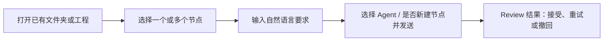
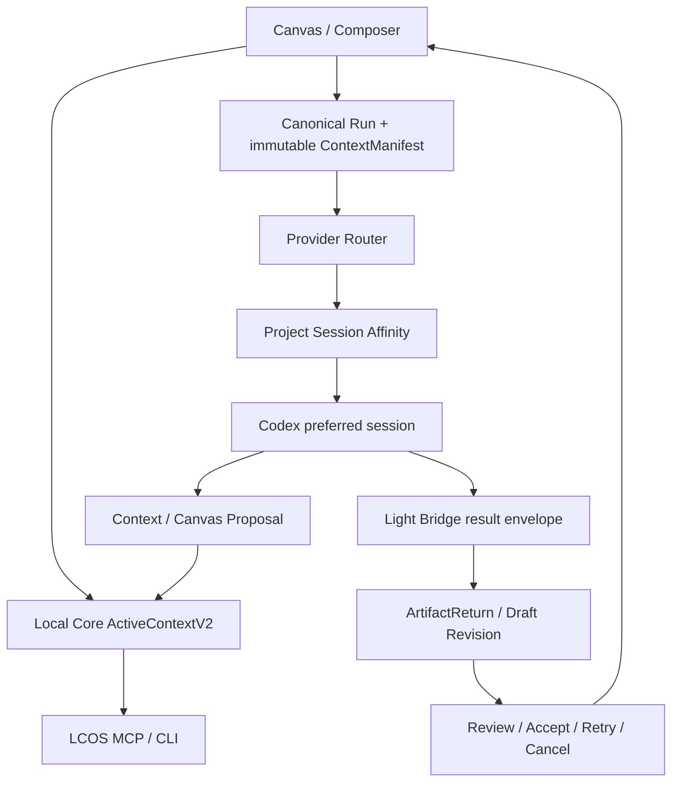

# Local Creative OS 合并前最终工程需求

> 日期：2026-08-04  
> 目标分支：`codex/backend-hardening-20260802`  
> 目标：在保留现有全栈能力与领域边界的前提下，完成 Codex 自动接单、tldraw/Cowart 式实时视觉上下文和生产级连续交互，达到可并回主线的真实项目体验。

## 1. 产品结果与硬性口径

新用户从选中资料到 Agent 开始执行不得超过 3 个核心动作，从打开项目到获得首个可 Review 结果不得超过 5 个核心步骤：



用户不得被要求理解或选择 `outputIntent`、Target ID、Revision ID、Result Policy、Skill、Runtime Root、Task ID、Session ID、changed_files 或 Provider 状态。系统与 Agent 必须归纳这些内部操作；只有歧义、冲突、覆盖、删除、权限和其他高风险行为需要用户确认。

## 2. 当前问题必须一次解决

| ID | 问题 | 完成标准 |
|---|---|---|
| FINAL-01 | 自动 Codex 每个 Run 可能冷启动或拉新对话 | 同一 Project + Provider 优先复用首个有效 Session |
| FINAL-02 | watchdog 轮询与事件重复、启动慢、噪声大 | 单实例、增量游标、幂等事件、退避与可诊断延迟 |
| FINAL-03 | Skill、CLI、MCP、Bridge 合同发生漂移 | 单一合同源和自动一致性测试，Skill 不得宣传不存在能力 |
| FINAL-04 | Canvas 变化还不是 tldraw/Cowart 式 Agent 视觉上下文 | Agent 在 1 秒内读取选择、视口、关系和节点摘要，并通过 Proposal 安全回写 |
| FINAL-05 | Run 输入暴露内部工作方式、结果去向和编辑目标 | GUI 仅保留 Agent 与“结果是否新建节点”两个用户选项 |
| FINAL-06 | 点击画布关闭 Composer 后长提示词丢失 | 未提交 Prompt 作为可恢复 CommandDraft 持久化 |
| FINAL-07 | 多选不符合常见桌面交互 | Ctrl/Cmd + 点击切换多选，框选和组移动/删除稳定可用 |
| FINAL-08 | Run 缺少用户可理解的撤回 | queued/running 可撤回；终态明确不可撤；迟到结果不得进入 Current |
| FINAL-09 | ActiveContext、Selection、Composer、Agent 读取可能不同步 | 四端使用同一 versioned ActiveContext Truth |
| FINAL-10 | Core/Bridge 轮询和恢复逻辑仍有演示型实现 | 结构化错误、幂等、租约、恢复、冲突和失败路径都有真实实现与测试 |

## 3. 目标总体流程



边界保持不变：Web 管交互，Local Core 管项目真相，Bridge 管执行任务，Agent 会话不是 Project Truth；任何 AI 结果在用户确认前不得静默覆盖人工 Current。

## 4. Workstream A：项目级 Agent Session Affinity

### 4.1 必要模型

新增持久化的 Provider Session Binding，逻辑唯一键为：

```text
projectId + provider → preferredSessionId
```

最少字段：`projectId`、`provider`、`externalSessionId`、`origin(manual|watchdog)`、`status(active|stale|closed)`、`lastSeenAt`、`lastRunId`、`leaseOwner`、`leaseExpiresAt`。Schema 与 Migration 必须单独评审，不得用 JSON 临时文件冒充正式真相。

### 4.2 路由规则

1. 用户手动让 Agent 接取后，claim/start 必须登记当前 Session。
2. watchdog 首次拉起成功后登记 Session。
3. 后续 Run 优先发送到同一有效 Session，不默认新开。
4. 同一 Project + Provider 的执行队列默认串行，避免同一对话并发污染上下文。
5. Session 不存在、明确关闭、租约失效或恢复失败后才能拉新，并原子替换绑定。
6. 用户可在 Diagnostics 中查看、切换或解除绑定，但普通 Run 流程不暴露 Session ID。
7. Run、Task、Session 三者保持独立 ID 和生命周期。

### 4.3 验收

- 连续派发 3 个 Run，只有第一个允许创建新 Session，后两个复用相同 Session。
- 手动接取建立的 Session 能被 watchdog 后续复用。
- 无效 Session 自动降级换新一次，不形成无限拉窗。
- 两个 Project 不共享同一首选 Session，除非未来有明确跨项目能力。

## 5. Workstream B：tldraw/Cowart 式视觉上下文

这里的本质不是嵌入 tldraw 编辑器，也不是让 Agent 抓 DOM，而是建立可版本化、可订阅、可定位、可安全回写的 Canvas Control Surface。

### 5.1 Agent 可读状态

以 Local Core 为真相，提供一个稳定的 `CanvasContextSnapshot`：

- `projectId`、`workspaceId`、`version`；
- 当前选择和多选顺序；
- Target、Pinned Context、Excluded Context；
- 当前 viewport 和可见节点 ID；
- 节点的 Artifact/View/Revision 身份、标题、类型、状态、坐标与受控摘要；
- 一度关系及 relation type；
- 当前 Composer Draft 的存在状态，但不把未发送正文泄漏给非当前授权 Agent；
- 数据更新时间与来源。

Web 的 Selection/Viewport 经 debounce/batch 写入 Core；Codex 内置浏览器、MCP、Composer、Inspector 都读取同一 version。目标延迟不超过 1 秒；优先 SSE，短轮询只作为降级路径。

### 5.2 Agent 安全写回

Agent 不直接改 React Flow state 或 SQLite，只能通过 LCOS MCP 提交 Proposal：

- 加入/移除 Context；
- 定位/聚焦节点；
- 创建 Relation；
- 建议创建 Text/Command/Derived 节点；
- 建议布局或分组。

影响 Context、关系、节点创建和布局的 Proposal 在 UI 可见；普通聚焦可直接执行。自动布局必须先预览后确认，不能覆盖用户稳定锚点。

### 5.3 tldraw 借鉴边界

- 借鉴其 store/snapshot、shape identity、camera、selection、change subscription 和 command transaction 思路。
- 不要求替换现有 React Flow；先建立框架无关的 Canvas Adapter。
- 不以 DOM、截图或浏览器缓存作为项目真相。
- Running Run 始终使用创建时冻结的 ContextManifest，不随实时选择漂移。

## 6. Workstream C：极简 Prompt 与 Run 创建

### 6.1 GUI 唯一可见决策

Composer 只显示：

1. 自然语言输入；
2. 已选择 Context 芯片，可直接增删；
3. 本地 Agent 选择；
4. “结果作为新节点”开关；
5. 发送按钮。

不再显示“工作方式、结果去向、编辑对象”等内部下拉框。

### 6.2 Agent/Core 推断规则

- 选中一个可修改节点且“新建节点”关闭：默认 `revise`，目标为该节点 Current Revision，结果生成 Draft Revision，绝不原地覆盖。
- “新建节点”开启：默认 `create`，选择内容只作为 Context，不作为修改 Target。
- 没有目标且关闭“新建节点”：Skill 判断为 `analyze/reply_only`；若用户要求产出文件则提出一次轻量确认或自动切换为新节点并明确展示。
- 多选中只有一个明显可修改对象时自动识别 Target，其余作为 Context。
- 多个同等候选 Target 或涉及删除/覆盖时必须 Proposal 确认。
- Skill 必须输出结构化 Run Proposal，Core 做最终 Domain Guard，不能只相信 Prompt 推断。

### 6.3 Prompt Draft 持久化

新增正式 `CommandDraft`（或在既有 Command 实体上增加明确 draft 生命周期），至少按 `projectId + workspaceId + composerAnchor` 恢复：

- 文本正文；
- Context View IDs；
- Agent；
- 是否新建节点；
- 当前目标候选；
- `updatedAt`。

输入 debounce 保存；点击画布、关闭 Overlay、切换节点、切换 Workspace、刷新和 Core 重启后可恢复。发送成功后归档到 Run 来源并清空当前 Draft；用户显式清空才删除。不得把一大段 Prompt 仅保存在组件 state。

## 7. Workstream D：Canvas 桌面级选择交互

- 单击：单选并立即反馈。
- Ctrl/Cmd + 单击：切换节点是否加入多选。
- 左键空白拖动：框选；Ctrl/Cmd + 框选为增量选择。
- Shift 可作为兼容追加键，但界面帮助以 Ctrl/Cmd 为主。
- 多选后显示持久组边界，可整体移动、加入 Context、创建 Workspace 归属、删除 Views。
- 输入框、Viewer 和节点内部可交互内容优先于 Canvas 快捷键。
- 双击保持已冻结的一度关系/Preview 方案，不允许单击等待双击导致迟滞。
- 必须覆盖 20 次快速选择、组拖动、缩放、平移和 Composer 未提交 Draft 不丢失的真实浏览器测试。

## 8. Workstream E：Run 撤回、取消与迟到结果

用户统一看到“撤回”，Core/Bridge 内部执行 canonical cancel：

| 当前阶段 | 用户行为 | 系统结果 |
|---|---|---|
| created/planned | 撤回 | 取消未派发 Run，不创建 Provider Task |
| queued/assigned | 撤回 | Bridge 原子 cancel，释放 lease，Run→cancelled |
| running | 撤回 | cooperative cancel；UI 显示“正在撤回”直到确认 |
| review | 撤回结果 | Reject ArtifactReturn；保留审计，不进入 Current |
| completed/failed/cancelled | 撤回 | 禁止，展示明确终态原因 |

迟到结果必须归档为 late result，不得生成可 Accept Draft，更不得修改 Current。重复撤回必须幂等。UI Activity 显示请求时间、确认时间、Provider 结果与失败原因。

## 9. Workstream F：Watcher / Orchestrator 生产化

- Runtime Host 只运行一个 watchdog 实例，PID、工作目录和启动签名可验证。
- 使用任务游标/更新时间增量读取，不得全量重复扫描。
- `run.started/review_ready/completed/cancelled/failed` 只按状态迁移写一次。
- 同 Run 的 claim、launch、resume、submit 都有幂等键和持久 cooldown。
- 优先恢复 Project preferred Session；只有恢复失败才拉新。
- 任务为空时指数退避，有新任务立即唤醒；不得高频空轮询。
- 区分冷启动、排队、Agent 启动、执行、回传、Ingestion 各段耗时，并在 Diagnostics 可见。
- MCP 不可用、Session 卡死、租约过期、进程退出和 Core 重启均有有限次数恢复；禁止无限拉窗或无限写日志。
- Launcher/托盘统一管理 Web/Core/Bridge/watchdog，退出只停止本实例，不杀其他 Node/Codex 进程。

## 10. Workstream G：Skill、CLI、MCP 与 Core 一致性

### 10.1 Skill 决策职责

LCOS 全局 Skill 负责把自然语言和 ActiveContext 归纳为 Proposal：推断 Intent、Target、Context、Result Policy、文件动作和是否需要确认；不要求用户选择内部参数。

### 10.2 工具最小闭环

- Project/Workspace/Canvas/Selection/ActiveContext 读取；
- Context Proposal；
- Run list/claim/start/heartbeat/fail/cancel/context/submit；
- Artifact/Revision inspect/compare/accept/reject/retry；
- 节点定位、关系与安全 Proposal；
- 统一结构化错误、JSON 输出、退出码和 dry-run。

### 10.3 一致性 Gate

建立机器可读 Capability Ledger，并自动验证：

```text
Contracts → Core route → CLI → MCP → Skill declaration → E2E
```

任一层缺失即不得在 Skill、README 或 UI 宣传为已实现。`contentHash` 等字段只有一个 canonical schema，生成的 Skill 示例从 schema 派生或由测试锁定。

## 11. Workstream H：Core 逻辑收口

- ActiveContext 与 Context Proposal 必须跨 Core 重启恢复；内存 Store 不作为生产完成。
- CommandDraft、Session Binding、RunEvent 幂等所需 Schema 采用向前 Migration，升级失败不破坏原库。
- Generic Mutation 不得绕过 Accept 修改 `currentRevisionId`。
- Run 创建先生成 Proposal，再由 Core 校验并冻结 ContextManifest。
- Result Ingestion 自己校验路径 containment、内容哈希、目标 Revision 和冲突；Bridge Artifact 不是 LCOS Project Truth。
- 统一错误码：离线、合同不兼容、Session 失效、租约冲突、Context version 冲突、文件 stale/unreadable、取消中、迟到结果。
- 所有写操作可重放且结果幂等；Fixture 不得静默接管 Runtime。

## 12. 分片与施工顺序

### Slice 0：合同与迁移评审（红区，先批准）

冻结 `ProviderSessionBinding`、`CommandDraft`、持久化 Context Proposal、CanvasContextSnapshot、Cancel acknowledgement 与 Capability Ledger；给出 Migration、回滚和兼容矩阵。

### Slice 1：交互止损

Prompt Draft 不丢、Ctrl/Cmd 多选、Composer 只保留 Agent/新节点、GUI 撤回入口。先解决每天直接伤害用户的问题。

### Slice 2：Session Affinity + Watchdog

手动/自动首接绑定、优先 resume、单项目串行、游标/退避/租约/延迟诊断、事件幂等。

### Slice 3：Skill/Core 决策闭环

自然语言 Proposal、Core Guard、CLI/MCP/Skill Ledger、一致性测试。

### Slice 4：Canvas Agent Surface

Canvas Adapter、Snapshot/SSE、内置浏览器实时读取、Context/Canvas Proposal 与 UI 确认。

### Slice 5：完整失败路径与合并 Gate

真实项目 5 次 Run、Session 复用、取消、迟到结果、刷新/重启、合同漂移、MCP 离线和浏览器连续交互。

## 13. 验收矩阵

| 场景 | 必须结果 |
|---|---|
| 选中单节点并输入修改要求 | 不再报缺 Target；生成 Draft Revision，Current 不变 |
| 选中多节点 | Ctrl/Cmd 多选稳定，系统识别一个 Target/其余 Context 或仅在歧义时询问 |
| 输入长 Prompt 后点击画布 | Composer 可关闭，重新打开全文和 Context 芯片仍在 |
| 连续派发 3 次 Codex Run | 复用同一 Project Session，不连续拉新窗口 |
| 手动接取首个 Run | 后续 watchdog 能复用该会话 |
| Running 时撤回 | Provider 收到取消；迟到结果不进入 Draft/Current |
| 改变 Canvas 选择 | Codex 内置浏览器/MCP 1 秒内读到新 version |
| Agent 建议加入参考 | UI 展示 Proposal；未确认前 ActiveContext 不变 |
| Core/Bridge 重启 | Project、Draft、Session Binding、待 Review Run 可恢复 |
| 高频轮询 10 分钟 | 每种生命周期事件仅一次，无重复拉窗、无无界日志增长 |
| Skill 示例提交 contentHash | Bridge 接受合法 SHA-256；非法值结构化拒绝 |

## 14. 必跑质量链

```text
lint → typecheck → unit → build → architecture → integration
→ Light Bridge tests → Codex real E2E × 5
→ Session reuse/restart/cancel recovery
→ Browser interaction Golden Path
```

不得使用脚本模拟 Claim 代替真实 Codex 接单结论；不得用“进程存在”代替结果回收成功。性能报告至少分解 P50/P95：Run 创建→claim、claim→Agent 开始、开始→submit、submit→Review。

## 15. 交付要求

开发方必须交付：

- 每个 Requirement ID 的 GUI/Core/Bridge/CLI/MCP/Skill/E2E 证据；
- Schema 与 Migration 报告；
- 修改前后流程图；
- 真实项目录屏或截图；
- 未完成和降级能力；
- 启动、停止、恢复、诊断和回滚说明；
- 一个干净、可复现、无凭证、无 Runtime 数据的后端源码包。

## 16. 禁止项

- 不以 localStorage 保存 Project/Run/Revision 真相；
- 不用 DOM 抓取模拟 Agent Context；
- 不让 Agent 静默扩大 Context、覆盖 Current 或修改源文件；
- 不把 Provider Task 状态塞进 Canonical Run；
- 不以无限轮询、重复事件或持续拉新窗口实现“自动化”；
- 不把 Mock、Fixture、脚本代理或未验证 Skill 作为完成证据；
- 不为实现 tldraw 思路擅自替换整个 Canvas 技术栈。

## 17. 当前基线补充

当前工作树已完成但尚未提交的稳定性修复包括：

- Light Bridge `ChangedFileV1.contentHash` 合同对齐；
- Runtime 生命周期事件改为状态迁移时单次写入；
- 对应 Core、Bridge、Architecture 测试通过。

开发方必须保留这些修复，不得在后续大改中回退。
