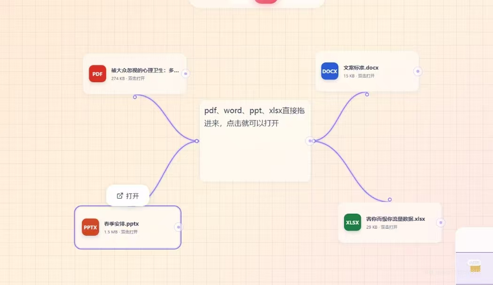
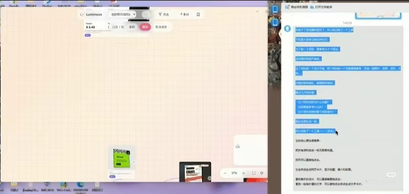
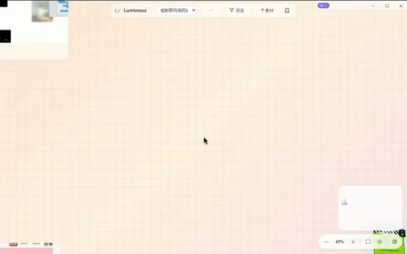
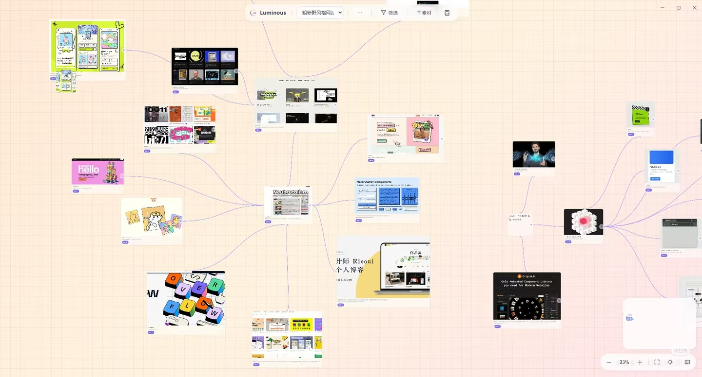

# LCOS GUI 设计参考：Spatial（用户原称 Special）审美研究 + 交互调研

> 日期：2026-08-11
> 目录：`docs/research/`
> 性质：GUI 审美方向调研 + 幕布/飞书/spatial 开源参考/herdr 交互逻辑研究 + 搜索技术路径对比 + 会话衔接平台现状

---

## 0. 身份核实：用户说的"Special"到底是谁

### 0.1 结论先行

用户提供的描述：

> 一位瑞典设计师耗时 18 个月打造的 macOS 空间化笔记应用……一款 macOS 上的空间化笔记视觉画布应用，作者将其描述为"可以装下所见所想想记住的东西的数字鞋盒"……纯白极简风格，没有缩放比例、小地图，连图包和菜单栏都没有……拖动文件时会用标尺标清……本地优先，底层用 markdown……支持语义搜索，输入相关词就能搜出对应素材，不需要手动打标签……免费收集前 500 个灵感……

公开检索（2026-08-11，多轮关键词 + GitHub API）**找不到名为 "Special" 的 macOS 笔记应用**。找到的、与描述高度吻合的产品是 **[Spatial](https://must.tools/product/spatial)**（must.tools 收录）：

| 描述项 | 用户描述（唯一信息源） | 公开收录页（已核） |
| --- | --- | --- |
| 产品名 | Special | Spatial（must.tools / early.tools） |
| 定位 | 空间化笔记视觉画布 / 数字鞋盒 | macOS 视觉笔记应用 / "digital shoebox" / 自由画布 / stacks 分组 / 网页剪辑 |
| 作者 | 瑞典设计师独立开发 18 个月 | **未获一手公开来源确认** |
| 风格 | 纯白极简、无缩放/小地图/菜单栏 | 早期收录页未逐项确认；"freeform canvas"可确认 |
| 数据 | 本地优先、底层 markdown | 未逐项确认 |
| 搜索 | 语义搜索、免标签 | 未逐项确认 |
| 免费 | 前 500 条灵感免费 | 未逐项确认 |
| 收录时间 | — | early.tools 2026-04 收录，当时 Alpha |

**诚实声明**："瑞典设计师""18 个月""纯白极简到没有缩放/小地图/菜单栏""标尺拖拽""本地 markdown""免费 500 条"目前只有用户提供的文字这一条来源，公开网页没有对应一手证据。本报告把它们当作**设计方向输入**来用，不作为已核实的产品事实。

### 0.2 两个"spatial"不要混淆

- **Spatial app**（本报告主角）：must.tools / early.tools 收录的 macOS 视觉笔记应用，用户原称 "Special"。
- **spatial 开源参考**（上一轮用户给的）：GitHub 上 [agriev/next-gen-claude-ux](https://github.com/agriev/next-gen-claude-ux)（应用名 **Interactive Jarvis**），官方描述第一个词就叫 "Spatial multi-agent workspace for Claude"，所以名字确实撞了——但它和 must.tools 的 Spatial app 是两回事。本报告 §3 单独讨论。
- **热度警告（2026-08-11 核实）**：`agriev/next-gen-claude-ux` 是 **0 stars / 0 forks / 0 issues** 的个人原型仓库，2026-05-09 创建、2026-05-26 后无更新，全网（HN/Reddit/X/中文社区）**没有找到任何第三方报道或社区评价**。它有价值的是**设计思路**（下文 §3 逐条拆），不是社区背书。

---

## 1. Spatial app 审美研究

### 1.1 已核实的公开信息

来源：[must.tools 收录页](https://must.tools/product/spatial) 与 [early.tools 收录页](https://www.early.tools/spatial)（2026-08-11 检索）：

- macOS 平台的视觉笔记/灵感收集应用，定位为"数字鞋盒"（digital shoebox）——什么东西都可以往里放。
- 核心交互是自由画布（freeform canvas），支持 stacks 分组（类似堆叠/集合）。
- 支持网页剪辑、图片、视频、速记板（通用便签）等内容类型。
- early.tools 于 2026-04 收录，当时为 Alpha 阶段。
- 理念是"add almost anything"——内容收集门槛极低。

### 1.2 用户描述中的可提炼原则（标注：仅用户描述，未一手核）

按设计可落地性排序：

| 原则 | 用户描述 | 为什么对 LCOS 有价值 |
| --- | --- | --- |
| 减法 | 省掉一切不必要的元素（无缩放比例、无小地图、无菜单栏） | 用户一直在抱怨"太多没用的信息展示和小栏目是给测试用的/给 AI 看的" |
| 细节偏执 | 每一条动画曲线、每一次拖拽手感、调色盘配色都精心挑选；自定义拖拽提示（标尺） | 用户抱怨"版本数字动一下就跳一下""拖动 drop 和相机移动冲突"——都是手感问题 |
| 语义搜索免标签 | 输入相关词就能搜出素材，不需要手动打标签 | LCOS 搜索管线已具备（FTS+vector+related），缺的是"免标签"的体验编排 |
| 本地优先 | 数据存在本地，底层 markdown 可迁移 | LCOS 本来就是本地 SQLite + 文件链接，方向一致 |
| 克制配色 | 纯白极简 | 用户说"配色和风格向大厂学习"，克制是高级感的来源 |
| 免费门槛 | 前 500 条免费 | 与 LCOS 无关，不采用 |

### 1.3 映射到 LCOS 的具体建议

**A. 该"删/收"的（对应"减法"）**

1. **右侧 AgentContextSurface 卡片**：用户原话"现在看上去还是测试窗口一样的，挡了一大块地方，平时交互的时候根本不需要这么一堆信息"。建议改成：默认收起为一个醒目小按钮（像 Windows 任务栏的通知角标），点开是浮层，点外部收起（用户要求的"点击卡片外区域即退出"）。
2. **运行时诊断页**：属于测试用途，普通用户应"居于幕后"——入口从主界面移到设置/关于深处，或加"开发者模式"才显示。
3. **版本数字**：不要每次状态变化都跳动，改成 hover/详情里才显示。
4. **节点上的信息密度**：用户说"很多信息是为了加而加""空着就默认不显示，AI 输入了才显示备注"。建议空字段默认隐藏，信息按需出现。
5. **给 AI/测试看的翻译字段**：之前翻译过但"对用户也是无效干扰信息"——属于测试态的字段应整体后置。

**B. 该"做得更细"的（对应"细节偏执"）**

1. **拖拽手感**：用户已验证"顿一下触发 drop"方案（停顿 → 触发投送 → 相机不再移动 → 虚影拖进目标空间 → 原节点复位）。建议把这条交互做成系统级状态机（`dropIntentMachine` 已有），并配齐视觉反馈：拖拽时显示标尺式对齐提示、目标空间高亮、放下后的成功动效。
2. **动画曲线**：所有浮层/弹窗/节点状态切换统一缓动曲线（如 ease-out 150-250ms），禁止"数字跳一下"式的生硬变化。
3. **光标反馈**：悬停节点、可拖拽区域、可投送目标分别给不同的光标形态。
4. **预览占满屏幕**：用户原话"像飞书文档那样直接占满屏幕，不光是照片、视频，还有文档"——`ImmersiveViewer` 已存在，需要扩展覆盖更多文件类型，并保证"节点上轻量封面预览 + 双击沉浸预览"两级体系。

**C. 语义搜索免标签的落地路径**

LCOS 已具备：混合搜索管线（会话/Core FTS + vector + related 1-hop 扩展）。缺的是：

- 一个"搜索框即入口"的全局体验（当前搜索分散在 CLI/MCP/各对话框里）。
- Agent 自动装配上下文时主动用搜索（skill 层编排），用户不必手动选来源。
- 首次语义搜索慢（Ollama 模型加载）的体验兜底：先返回 FTS 结果，vector 结果后到补齐，而不是让用户干等。

### 1.4 反模式警示：不要盲目复制"无缩放 + 无小地图"

**明确建议：LCOS 不要照抄"没有缩放比例、小地图、菜单栏"。**

理由：

1. **场景不同**：Spatial 是个人灵感库（几百条素材，靠语义搜索找回），LCOS 是项目画布（一个项目文件夹最大可以是一整类工作类型，能分品牌/品类/时间/项目节点），**多中心、高自由度是硬需求**，没有导航会灾难。
2. **量级不同**：LCOS 画布已出现掉帧（大量节点+连线），小地图/缩放/LOD 是性能兜底的一部分（AGENTS.md 性能降级顺序里有"视口外简化/虚拟化"）。
3. **用户自己的原话**：要"多中心结构""高自由度""极简保留"，同时"运行上下文在线性排布或节点排布一定要允许多中心"——这是"极简外壳 + 完整导航内核"，不是"砍掉导航"。

正确借鉴方式是借"降噪"和"交互惯性"：**信息该藏则藏（浮层/按钮后置），导航该强则强（小地图/缩放保留但做轻）**。

---

## 2. 幕布 / 飞书底层交互研究

### 2.1 幕布（大纲 ↔ 思维导图）

底层逻辑（从产品交互反推，非官方文档）：

| 交互 | 底层实现逻辑 | LCOS 对应 |
| --- | --- | --- |
| 大纲树 | 单一结构：每个节点有且仅有一个父节点，同级有序 | `ContextTreeSurface` / `presentationHierarchy`（**内存态，未落 Core**） |
| Tab 缩进 | 改变层级 = 改变父子关系 | 拖拽改父子 |
| 折叠/展开 | 折叠是**可见性**控制，不改变数据 | 折叠状态目前是内存态 |
| 拖拽节点 | 同时完成"移动位置 + 改层级 + 改顺序" | 需要一次手势完成三件事 |
| 大纲 ↔ 导图切换 | **同一份数据，两种投影**；层级一致、无额外规则 | `mindMapLayout` 已有但状态不落库 |
| 长笔记 ↔ 思维导图 | 同样数据不同形态，逻辑衔接、层级一致 | 用户明确要求"两个形态逻辑衔接，层级一致，不需要额外规则" |

**对 LCOS 的启示**：

1. 大纲/折叠/思维导图必须落到 Core（或至少可持久化的 PresentationView 契约），否则一切"切换形态"都是白做——用户一刷新就丢。
2. 拖拽节点应该同时改父子关系，而不是只改坐标。当前 GUI 里"拖拽=改坐标"，"连线=单独建关系"，两种操作分裂，用户觉得"逻辑层级呈现一塌糊涂"。
3. 幕布式的"层级即组织"可以作为"画布整理模式"的默认骨架：先归父级，再排顺序，最后自由摆放。

### 2.2 飞书（评论/文档交互）

| 交互 | 底层实现逻辑 | LCOS 对应 |
| --- | --- | --- |
| 评论 | 锚定到内容片段（选中的文字/位置），不脱离原文 | 节点上的决策/备注应锚定到节点/文件片段 |
| 侧栏气泡 | 评论列表在侧栏，点气泡**定位回原文**并高亮 | 决策/待办列表应能"点一下跳到对应节点" |
| 线程 | 评论线程保留在原位，回复不复制原文 | 备注/决策不要复制节点内容，只挂引用 |
| 文档预览 | 文档占满屏幕阅读，不被小窗挤 | `ImmersiveViewer` 方向正确 |
| 评论区交互 | 点卡片外区域收起/退出 | 用户明确要求"点击卡片外的区域就是退出" |

**对 LCOS 的启示**：

- 决策/备注/阶段总结三种"人话信息"（用户钦点的重点节点类型）应该像飞书评论一样：锚定、侧栏可见、点一下跳回节点。当前节点上的备注是"加在节点上的字段"，没有"决策中心"的侧栏聚合视图。
- 弹窗/浮层统一"点击外部关闭 + Esc 逐级退出"（Esc 已冻结，点击外部要补）。

### 2.3 两个参考合起来看

幕布教我们"**同一数据多投影**"，飞书教我们"**锚定与定位**"。LCOS 现在的 GUI 有投影（Surfaces）但数据不落库；有备注但没锚定聚合。下一轮 GUI 优化的两个主线已经很清楚了。

---

## 3. spatial 开源参考：agriev/next-gen-claude-ux

### 3.1 项目全貌（README 一手资料，2026-08-11 核实）

**仓库名**：`agriev/next-gen-claude-ux`
**应用名**：Interactive Jarvis（作者给产品起的名字，仓库名是"下一代 Claude UX"的意思）
**官方描述**：Spatial multi-agent workspace for Claude — like Obsidian but actually 3D, like Iron Man's Jarvis but actually possible. Concept / prototype.

**一句话定位**：桌面应用，把大量工作知识变成 3D 画布上的命名卡片，Claude 本地多 Agent 系统负责干活——你说话，Claude 直接在画布上布局给你看。作者自己说"就是托尼·斯塔克对话的那个东西"。

**心智模型**（几乎和 LCOS 一一对应）：

| Interactive Jarvis | LCOS 对应 | 差异 |
| --- | --- | --- |
| Cards（artifacts）= 文档/笔记/代码/日志/图片/图表 | 节点（Artifact） | LCOS 还有对话导入，更宽 |
| Edges = derives / references / contradicts / groups-with | 关系（relation，含 kind） | 语义边类型一致 |
| Clusters = 半透明标签区域 | 归组/集合（Presentation） | LCOS 的 Presentation 未落库 |
| Boards = 独立画布（项目） | Project / Workspace | 一致 |
| 四角色 Agent：Worker / Layout / Listening / Naming | Bridge Run + curator/lcos skill | LCOS 角色化 skill 刚起步 |
| 进程内 MCP servers（canvas-tools / layout-tools / listening-tools） | lcos MCP servers | 思路一致：工具直接改 WorldState |
| better-sqlite3 + WAL 唯一真相源 | SQLite Core | 一致 |
| 文件系统双向同步（markdown 镜像 + git 自动提交） | 文件链接 + 哈希 | LCOS 不镜像原文件，按规则更安全 |

**作者自己承认的边界（原文）**：

- "personal-tool prototype I built for myself"——给自己做的个人工具原型。
- "full of rough edges"——到处是粗糙边缘。
- "Performance with 100+ cards needs work"——100+ 卡片性能需要优化。
- "There's no test suite"——没有测试套件。

**技术栈**：Electron 32 + React 18 + Three.js（@react-three/fiber + drei，弹簧物理自定义边）+ @anthropic-ai/claude-agent-sdk（四个 Agent 各自独立 query() 调用，长驻 Agent 用 streaming-input + setModel() 热切换模型）+ better-sqlite3 WAL + chokidar 文件同步 + fuse.js 模糊搜索 + PlantUML/Mermaid 渲染。MIT 协议，三平台安装包走 GitHub Releases。

### 3.2 值得 LCOS 借鉴的交互机制（重点）

| 机制 | 原文行为 | LCOS 借鉴价值 |
| --- | --- | --- |
| **shift-drag 移动并 auto-pin** | 手动移动过的卡片自动"钉住"，Layout agent 重排时跳过钉住的卡片 | **高**：正好解决 AGENTS.md"自动排布不得覆盖用户稳定锚点"的实现问题——手动动过=锚点，Agent 重排自动跳过 |
| **Cmd+L 一键重新整理** | 按类型/标签/主题/时间/自定义交给 Layout agent，旧 cluster 清掉、新建 cluster | **高**：这正是用户要的"画布整理模式"的现成参考：一键整理 + Agent 接管布局 |
| **Cmd+L → ↶ 恢复上一个布局** | 布局历史栈保留最近 10 次，一键回退 | **高**：整理模式必须有回滚，这就是实现样例（LCOS 可用 Checkpoint 替代） |
| **按 Agent 角色分别切模型** | Worker/Layout/Listening/Naming 各自独立选模型 | 中：LCOS 目前一个 Run 一个模型，角色化模型是远期优化 |
| **卡片 @shortName 引用** | 输入框里 @cardName 引用已有卡片 | 中：LCOS 的 @ 引用/上下文选择可以参考 |
| **2D/3D 一键切换（T）** | 俯视 2D 模式 | 低-中：LCOS 不需要 3D，但"形态切换"思路与多投影一致 |
| **长驻 Listening agent 分段输入** | 把输入流切成可执行的 utterance（作者说还是 stub） | 低：LCOS 的语音输入不在当前范围 |

### 3.3 结论与注意

1. **它是"设计思路"参考，不是"社区验证"参考**：0 star 个人原型、无测试、无社区评价，作者自己都说"probably not the right one"。不要把它当作经过验证的架构。
2. **但它恰好是 LCOS 想法的同构物**：卡片+语义边+区域+多 Agent 工具面+本地 SQLite——这说明 LCOS 的底层模型是主流共识方向，方向上不用怀疑。
3. **最值得抄的两个交互**：auto-pin 锚点保护和"一键整理+历史回退"。这两个正好是 LCOS 画布整理 skill 缺的闸门设计。

**注意**：这是交互形态参考，不是架构参考——LCOS 的 Core/Bridge 边界不应为它改变。

---

## 4. herdr 评估

### 4.1 已核实

GitHub 仓库 [herdrdev/herdr](https://github.com/herdrdev/herdr) 存在，约 27k stars（2026-08-11 检索）。

### 4.2 herdr 是什么

一个 agent 编排/运行的常驻后端：agent 保持常驻（daemon），通过状态机（working / blocked / idle）表达运行状态，CLI 和 socket 通道都能向 agent 派活，支持 agent 之间的协作。

### 4.3 对 LCOS 的评估

**结论：值得借鉴状态机与常驻会话模型，但 Bridge 仍应是 LCOS 的任务真相层。**

| herdr 机制 | LCOS 现状 | 借鉴方式 |
| --- | --- | --- |
| agent 状态机（working/blocked/idle） | Bridge 已有 Run 状态机（更完善） | 状态机层面 LCOS 不弱于 herdr |
| 常驻后端 | Bridge（43122）常驻 | 一致 |
| CLI/socket 双通道派活 | CLI + MCP + Bridge 三通道 | 一致（LCOS 通道更多） |
| agent 互相派活 | 跨会话派单未收口 | **这是 LCOS 缺 herdr 的部分**：herdr 的 agent 协作是产品核心，LCOS 目前只有单 Agent 闭环 |

用户说"我们已经初具 harness 的某些架构了"——这个判断成立：LCOS 的 Bridge 租约/认领/心跳/取消/结果信封本身就是 harness 形态。缺的不是架构，是**跨会话派单的收口和 skill 编排**（见报告 1 §3.6）。

---

## 5. 搜索技术对比：Ollama 语义搜索 vs CLI/MCP 搜索

### 5.1 结论先行（大白话）

**CLI/MCP 只是入口，进去以后用的是同一条搜索管线。** 真正决定"快不快、准不准"的是底层管线：

```text
用户输入
  → CLI 搜索命令 或 MCP 搜索工具 或 GUI 搜索框（都是入口）
  → project-search-service.search()（唯一管线）
      ├─ 会话 FTS（全文检索，快，永远可用）
      ├─ 派生 search_documents FTS（Phase G，快）
      ├─ vector 语义检索（Ollama 可用时，慢一点，但能搜"意思相近"）
      └─ related 1-hop 扩展（种子 ≤10 / 邻居 ≤5）
  → 合并排序输出
```

### 5.2 关键事实（代码证据）

1. **混合管线已就绪**：`project-search-service.ts` 把 FTS + vector + related 合在一起，vector 失败不会让搜索挂掉（降级 FTS）。
2. **Ollama 未装**：`semantic-index-service.ts` 默认模型 `nomic-embed-text`、默认 URL `127.0.0.1:11434`、有 loopback 守卫；embed 失败会报告 `unavailable`，文档保持 FTS 索引，向量留到下次补。
3. **"首次搜索会慢"指的是 Ollama 模型加载**：第一次 embed 要加载模型（秒级到十几秒），之后有缓存。**不是每次启动 LCOS 都慢，也不是每个新项目都慢**——是 Ollama 服务首次冷启动。
4. **⚠️ 重要修正：当前向量查询不是 KNN**。`metadata-repository.ts` L1810 `querySearchVectors` 是把所有向量读进内存逐条算点积再排序（线性扫描）。Phase G 文档说 `vec0.dll` native 就绪（289KB），但代码实际走的是内存扫描。数据量小的时候无所谓，量大了要换 sqlite-vec KNN。
5. **CLI 搜索超时**：`tools/lcos-agent/commands/search.mjs` 已把 `timeoutMs` 提到 120 秒（未提交改动之一）。

### 5.3 能否替代"画布上直接点击输入提示词"这一步

| 场景 | 能不能替代 | 说明 |
| --- | --- | --- |
| "我要整理这些节点"（选目标） | 🔶 部分 | 搜索能替代"手动选上下文/选文件"；Agent 自动搜索候选 → 组上下文 |
| "帮我把 X 做成 Y"（输入意图） | ❌ 不能 | 搜索替代不了"用户要干什么"这个输入本身 |
| "我之前的某个决定在哪"（找回） | ✅ 能 | 这正是语义搜索的主场 |
| "双击节点弹提示词"（上下文感知） | 🔶 部分 | 建议保留（用户已确认"第一次点不触发，选中后再点一次"），但提示词默认带上该节点的上下文摘要 |

**建议**：画布点击输入提示词保留（它是"对当前对象说话"的最短路径），同时把"选上下文"这个步骤从用户身上拿走——Agent 根据提示词自动装配（报告 1 §3.3）。

### 5.4 Ollama 的性价比

| 维度 | 评估 |
| --- | --- |
| 是否必须 | 不是。不装也能用（FTS + related），装了才有语义召回 |
| 收益 | 语义搜索免标签（用户想要的）、跨语言/同义召回、Agent 自动装配上下文的候选质量 |
| 成本 | 本地免费（电费）、模型小（nomic-embed-text 约 0.5GB 级别）、无 API 费用 |
| 隐私 | 本地 embedding，数据不出机器 |
| 风险 | 首次冷启动慢；内存线性扫描在数据量大时是瓶颈（要换 KNN） |

**结论**：值得装。装完跑 `npm run smoke:conversation-semantic` 验证，然后再把 `querySearchVectors` 从线性扫描升级到 sqlite-vec KNN（Phase G 声明的目标状态）。

---

## 6. LCOS 会话衔接平台现状

### 6.1 原定目标（MVP 计划中的最高优先级）

> LCOS 作为不同 session、不同 agent 的衔接沟通平台。

相关规划文档：

- `docs/design/LCOS_PRODUCTION_INTERACTION_CONSOLIDATION_CONSTRUCTION_PLAN_20260803.md`：DZ-CORE-02 + 8.4 Session + Context Pack。
- `docs/product/LCOS_CODEX_NATIVE_LOOP_PREMERGE_DEVELOPMENT_PLAN_20260804.md`：P0 派单接单闭环、Conditional Go。
- `docs/coordination/CROSS_PROJECT_HANDOFF_PROTOCOL.md`：跨项目交接协议（**仍是 Draft**）。

### 6.2 现状（已核实）

| 能力 | 状态 | 证据 |
| --- | --- | --- |
| 单 Agent 闭环（claim/start/heartbeat/submit） | ✅ 通 | MCP lcos-executor + Bridge |
| 会话 ID 归因（B7） | ✅ DONE | 多 Agent 会话归因已落 |
| 跨会话自动化接单 | 🔶 未收口 | 平台级"无回合唤醒 Codex"做不到，按 Conditional Go 走会话内接单 |
| 跨项目交接 | ⛔ Draft | 协议文档未定稿 |
| 建议记录重启保留 | ⛔ 未做 | 需要 v14 表（红区，待用户批准） |
| 关闭 Codex 后后台继续干 | ⛔ 做不到（平台限制） | 只能"会话开着自动接单" |

### 6.3 差距分析

要达到"会话衔接平台"，还差：

1. **跨会话派单收口**：一个会话创建的任务能进入 Bridge 队列，另一个会话（常驻监听）能接单并回传。现在单 Agent 闭环通，跨 Agent 的租约路由（谁接、接哪个）没有收口。
2. **接单提示的可见性**：用户要求"把接取提示派给我们正常项目里的对话窗口"（不是拉起子对话）。这需要 GUI 侧"待接单"的实时呈现（SSE 已通，可以把提案列表/待审数并入推送）。
3. **会话/任务状态同步**：herdr 式 working/blocked/idle 状态机可以借用，但 Bridge 仍是任务真相层。
4. **skill 编排**：跨会话派单 skill（报告 1 §3.6）。

---

## 7. 结论与下一步

### 7.1 审美方向

1. **借鉴 Spatial（Special）的"减法"与"细节偏执"**：信息该藏则藏（右侧卡片收成小按钮、诊断页后置、空字段不显示）、交互手感做到位（拖拽标尺/光标反馈/统一缓动）、预览两级体系（节点封面 + 沉浸全屏）。
2. **不照抄"无缩放/无小地图"**：LCOS 是多中心项目画布，导航是刚需；借鉴"降噪"而非"砍功能"。
3. **学幕布的数据投影、学飞书的锚定定位**：大纲/折叠/思维导图同一数据多投影（先落库），决策/备注锚定节点可跳回。

### 7.2 技术路径

1. 搜索统一走 `project-search-service` 混合管线；CLI/MCP/GUI 都是入口。
2. 装 Ollama（用户自装）→ 跑 `npm run smoke:conversation-semantic` → 把向量查询从内存线性扫描升级为 sqlite-vec KNN。
3. 跨会话派单收口 + 提案列表/待审数并入 SSE。

### 7.3 一句话给开发/前端

**界面做减法，数据做加法（Presentation 落 Core），交互做手感（拖拽/动效/预览），Agent 做自动（上下文装配/画布整理）。**

---

## 8. 同行者二：流光（用户提供，2026-08-11）

### 8.1 身份说明

「流光」是用户在小红书上看到的、另一位独立开发者 vibecoding 出来的浏览器资料整理工具。**公开检索（2026-08-11）未找到该工具的官方页面或报道**（同名搜索只命中无关的"流光卡片 API"），以下全部内容来自用户提供的产品介绍文字与 5 张截图，截图仅作存档，未经本模型视觉验证。

截图存档目录：`docs/research/assets/liuguang-20260811/`










### 8.2 产品描述（按用户提供文字整理）

**痛点**：做项目要参考几十个网站，浏览器标签越开越多；收藏夹越来越乱、截图越来越多；过几天回看时"这个网页为什么收藏？这张图是参考什么的？这个资料到底和哪个项目有关？"——全部乱成一团。

**核心想法**：把所有资料放进一张无限画布里。

**功能清单**：

| 功能 | 描述 | LCOS 对应/差异 |
| --- | --- | --- |
| 网页直接拖进画布 | 自动生成网页卡片，显示标题、简介和封面，点击直接跳转 | LCOS 有 URL 引用，卡片化封面跳转方向一致 |
| 截图拖进去 | 看到喜欢的设计直接截图拖进画布 | LCOS 有图片节点，截图粘贴/拖入体验待验证 |
| 文字复制成卡片 | 一段有价值的文字复制进去自动生成文字卡片 | LCOS 文本节点 + 剪贴板导入 |
| 图片/视频/音频 | 都可以放进去 | LCOS 视频/音频节点存在但预览体系待完善 |
| 素材之间连线 | 网页参考 → 设计截图 → 设计说明 → 项目文件，全部连接起来 | **与 LCOS 语义边完全同构**（derives/references/groups） |
| 桌面端文件 | Word/PPT/Excel/CSV 拖进画布后可直接打开本地文件 | LCOS 桌面端文件打开/预览是当前正在补的短板 |
| 定位 | "不只是收藏，更像是在整理你的思考过程" | 与 LCOS"记录/整理思考过程"定位一致 |

### 8.3 与 LCOS 的同构与差异

**同构点**（再次印证 LCOS 方向正确）：

1. "无限画布装所有资料"——与 LCOS 自由画布一致。
2. "素材之间连线 = 整理思考过程"——与 LCOS 语义关系一致。
3. "打开画布看到整个项目全貌"——与 LCOS 项目画布定位一致。
4. "一期视频的资料放一张画布里"——正是 LCOS 多中心/工作集的使用场景。

**差异点（LCOS 的护城河）**：

1. 流光本质是**个人收藏整理工具**（收集 + 排列 + 连线），LCOS 是**项目操作系统**（收集 + 排列 + 连线 + **Run/审核/交接/跨会话**）——流光没有任务执行层。
2. 流光没有本地 Agent：连线、分类、归档全靠用户手拖；LCOS 有 skill/MCP/CLI 三通道让 Agent 代劳。
3. 流光没有"决策/备注/阶段总结"的语义化节点，LCOS 已把它列为重点节点类型。
4. 流光是纯桌面个人工具，LCOS 面向"本地 agent 的超级补丁"（见 §9）。

---

## 9. LCOS 产品战略思考（用户原话重点，2026-08-11）

> 以下内容为用户提供的战略思考，按原意整理，是后续 GUI 触达设计的最高优先级输入。

### 9.1 必须支持：Web Chat 上传附件的同等导入管理

**用户原话**：

> 需要做到对上传 web chat 的项目文件，上下文也支持同样的导入管理。

即：用户在 Web Chat（chatgpt/元宝/飞书/微信等 C 端对话产品）里上传的项目文件，LCOS 也要能像本地导入一样把它收进画布、挂进上下文、参与整理。这是"衔接沟通平台"定位的延伸——**不是只整理自己电脑里的文件，而是整理用户在一切对话产品里上传/产出的文件**。

**两个获取思路（用户提出，本报告补充评估）**：

| 思路 | 做法 | 优点 | 风险/难点 | 评估 |
| --- | --- | --- | --- | --- |
| A. 扒浏览器上行记录 | 通过浏览器扩展的 webRequest / DevTools Protocol Network 事件，或本地 agent 浏览器内核对上传事件做拦截，捕获上传文件的 URL/流 | 全自动、无感、能拿到原始文件；本地 agent 浏览器本来就在我们手里 | 上行请求不一定落盘、带签名 URL 会过期、大文件分片要重组；通用浏览器扩展有权限边界 | **推荐主力**：本地 agent 浏览器内嵌集成最稳；通用浏览器（Chrome/Edge）用扩展做降级 |
| B. 给 Chat Web 准备一个 skill | 本地 agent 打开 chat web 页面，用 skill 读取会话附件（DOM 提取/下载按钮/元素定位） | 零侵入、不需要浏览器权限、实现快 | 依赖页面结构，改版就坏；下载需登录态；逐产品适配成本高 | **推荐兜底**：A 做不到的产品用 B 补 |

**结论建议**：A 为主（本地 agent 浏览器内嵌上传事件 + 通用浏览器扩展 webRequest 监听），B 为兜底（skill 逐产品适配）。两者都围绕同一个落点：**任何对话里出现过的文件，用户说一句"收进项目"就进画布**。

### 9.2 用户触达优先级：弹窗 / 快捷键 / 浏览器插件

**用户原话（核心）**：

> 电脑尤其是笔记本的屏幕占比比手机在工作时更加珍贵；不是所有人都和视觉创作者以及设计师一样有好几块屏幕。那么一个弹窗（快速唤醒）和快捷键（快速唤醒），以及内置于本地 agent 浏览器的插件，这些都是最重要的用户触达部分，也是我们后续和一大堆类似产品能起到区别的重点。

**解读**：

1. **目标用户不是"折腾党"**：是"绝大部分日常工作靠浏览器页面切来切去、同时 20% 的时间也浪费在这上面的白领群体"——他们不愿意慢慢折腾本地 agent。
2. **触达手段优先级**：
   - 全局快捷键（快速唤醒）：任何界面按一下 → 呼出收容/整理入口。
   - 弹窗（快速唤醒）：选中即弹、剪藏即弹，符合"两步以内"原则。
   - 本地 agent 浏览器内置插件：agent 侧边栏浏览器本身就是 LCOS 的主场，插件形态把"网页 → 画布"的路径压到最短。
3. **与 workbuddy 等大厂产品的一致性**：大厂 agent 产品也做白领场景，但用户亲身经历验证——"就算用上了腾讯这种专门针对 C 端白领用户开发的 agent 产品，一样会出现 LCOS 视图解决的问题"。

> 注：此处的 workbuddy 指用户语境中的腾讯系 C 端白领 agent 产品，非 LCOS 项目内部 Bridge 执行器代号。

### 9.3 差异化定位：本地 agent 产品的"超级补丁"

**用户原话（核心）**：

> 我们相当于这些本地 agent 产品的超级补丁……这就是我们打败其它同类型产品的关键点。

**一句话定位**：大厂 agent 负责"干活"，LCOS 负责"把 agent 干活前后那些乱成一团的东西管起来"——对话、上传文件、参考网页、产出物，全部在画布上可见、可归组、可连线、可交接。**不是替代 agent，是给 agent 补上视图和组织能力。**

### 9.4 对 GUI 设计的具体要求（落到下一轮）

1. **唤醒优先于浏览**：主界面不再是"打开项目 → 翻画布"，而是"任何场景一键唤起 → 把当前内容收进去"。
2. **收容动作必须两级以内**：选中内容 → 快捷键/弹窗 → 进画布（参考"点击卡片外即退出"的交互直觉）。
3. **浏览器插件形态**：网页里看到什么，右键/快捷键直接"收进 LCOS"，自动生成网页卡片（标题/简介/封面）+ 自动建议归属项目。
4. **笔记本单屏适配**：画布、工作栏、弹窗要在 13-14 寸屏幕上不挤（这正是"右侧大卡片收成小按钮"的动因之一）。
5. **Web Chat 附件导入**：作为衔接平台的 P0 能力，优先做本地 agent 浏览器内嵌路径。

---

## 附录：参考链接与证据

- Spatial app 收录页（已核）：[must.tools/product/spatial](https://must.tools/product/spatial)、[early.tools/spatial](https://www.early.tools/spatial)
- spatial 开源参考（已核）：[agriev/next-gen-claude-ux](https://github.com/agriev/next-gen-claude-ux)
- herdr（已核）：[herdrdev/herdr](https://github.com/herdrdev/herdr)
- 流光：无公开页面（2026-08-11 检索），内容为用户提供；截图存档于 `docs/research/assets/liuguang-20260811/`
- 搜索管线代码：`apps/local-core/src/project-search-service.ts`
- 语义索引代码：`apps/local-core/src/semantic-index-service.ts`
- 向量查询代码：`apps/local-core/src/metadata-repository.ts`（L1810 起）
- Phase G 交接：`docs/handoffs/PHASE_G_SEMANTIC_RETRIEVAL_HANDOFF_20260810.md`
- 架构普查：`docs/audit/LCOS_CURRENT_ARCHITECTURE_CENSUS_20260810.md`
